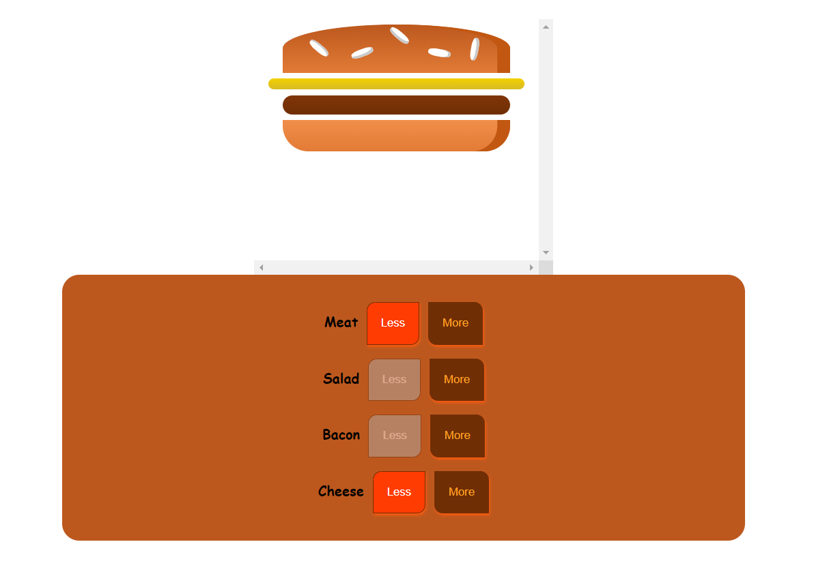
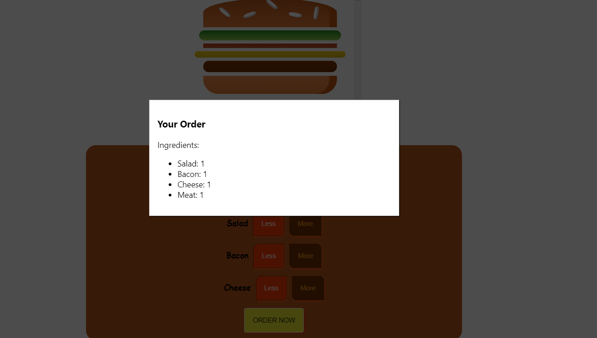

## 1 - Getting started
### 1.1 - First React Code

```html
<div class="person">
  <h1>React</h1>
  <p>Age: 28</p>
</div>
```
```css
.person {
    display: inline-block;
    margin: 10px;
    padding: 10px;
    border: 1px solid #eee;
    width: 200px;
    box-shadow: 0 2px 2px #ccc;
}
```

- To reuse the div above, add some dependencies. After adding react and react-dom, now it is ready to code as function by function.

```typescript jsx
function Person() { 
  return (
    <div className="person"> 
      <h1>React</h1>
      <p>Age: 28</p>
    </div>
  );
}
ReactDOM.render(<Person />, document.querySelector("#p1"));
```
- **ReactDOM.render(...)** This methods allows us to render a JS function as a component to the real DOM.
- It is not a exact HTML. 'class' becomes 'className' in JSX.
- The first parameter is the selector for the component Person, the second parameter tells that where to render it.

```html
<div id="p1"></div>
```
Now, it is going to be rendered the *div* whose id is *p1*.
But, 
```html
<div id="p2"></div>
```
It can't be reused. We can configure the components dynamically. ***props*** is used for it.
```typescript jsx
function Person(props) { 
  return (
    <div className="person"> 
      <h1>{props.name}</h1>
      <p>Age: {props.age}</p>
    </div>
  );
}
ReactDOM.render(<Person  name="React" age="12"/>, document.querySelector("#p1"));
```
- Dynamic parameters is passed in *..render(..)*. Thus we don't need to write for *p1* and *p2* separately.
```typescript jsx
ReactDOM.render(<Person  name="React" age="12"/>, document.querySelector("#p1"));
ReactDOM.render(<Person  name="React-DOM" age="21"/>, document.querySelector("#p2"));
```
- The parenthesis allows us to write multiple line of code in JSX
```typescript jsx
  return (

  );
```
- We can define component as a wrapped variable.
```typescript jsx
function Person(props) { 
  return (
    <div className="person"> 
      <h1>{props.name}</h1>
      <p>Age: {props.age}</p>
    </div>
  );
}
const app = (
  <div>
    <Person name="React" age="12" /> 
    <Person name="Reac-DOM" age="18" /> 
  </div>
);
ReactDOM.render(app, document.querySelector("#app"));
```
```html
<div id="app"></div>
```
We have to wrap with *div*, because JSX has the requirement of only having one root element. So adjacent elements are not allowed.
 
## 2 - Next-Gen JS
### 2.1 - let & const

- *let* is for creating variable that you really want to create a variable in a modern way.
- *const* for constants.

### 2.2 - Arrow Functions
- Traditional function definition:
```js
function x() {
  
}
```
- Arrow function definition:
```js
const myFunc = number => number * 2;
console.log(myFunc(5));
```
No more issues with ***this*** keyword. When use ***this*** in an arrow function, it keep its context and not changed surprisingly on runtime.
- The usage contracts of arrow functions is same lambda expressions in Java.

### 2.3 - Exports & Imports (Modules)
person.js:
```js
const library = {
    name: "React"
}

export default library;
```
- ***default*** keyword means if we just import something from that file that will be always our default export.
- So in this case *person* constant. Thus when we import person with file name *'person.js'*, we can name it as whatever we want.

utility.js:
```js
export const clean = () => {};
export const baseData = 10;
```
- Import syntax uses the curly braces to explicitly target specific things from that file. These are called ***named exports***

app.js
```js
import person from './person.js'
import prs from './person.js'

import {clean} from 'utility.js'
import {baseData} from 'utility.js'
import {baseData as SpecificName} from 'utility.js'
import * as bundled from 'utility.js'
```

### 2.4 - Classes
Class definition:
- [x] with constructor definition
```js
class Library {
    constructor() {
        
    }
    name = 'React';
    call = () => {};
}
```
Usage:
```js
const myLibrary = new Library();
myLibrary.call();
console.log(myLibrary.name);
```
Inheritance:
```js
class Library extends Code {}
```
Example: 
 ```js
class Gender {
  constructor() {
    this.gender = 'male';
  }
  
  printGender() {
    console.log(this.gender);
  }
}

class Person extends Gender {
  
  constructor() {
    super();
    this.name = 'React-DOM';
  }
  
  printMyName() {
    console.log(this.name);
  }
}

const person = new Person();
person.printMyName();
person.printGender();
```
- When a class extends another, ***super()*** calls should be done explicitly.
- ***this.name = 'React-DOM';*** definition gives us an instance field.

### 2.5 - Spread & Rest Operators
**Spread**: Used to split up array elements or object properties.
```js
const newArray = [...oldArray, 1, 2];
const newObject = {...oldObject, newProp: 5};
```
- If we want to add all the elements from the *oldArray* to *newArray* and additionaly add one or more elements.
- If we create a *newObject* with new properties, '...' is to pull out all the properties of the old object and their values and add them as key-value pairs to the new object.

**Note**: If *oldObject* has a property *newProp*, it would be overridden by a *newProp: 5*. It takes precedence.

**Rest**: Used to merge a list of function arguments into an array.
```js
function sortArgs(...args) {
    return args.sort();
}
``` 

### 2.6 - Destructuring
Easily extract array elements or object properties and store them in variables.
- Array Destructuring
```js
[a, b] = ['React', 'React-DOM'];
console.log(a); //React
console.log(b); //React-DOM
``` 
- Object Destructuring
```js
({name} = {name: 'React', type: 'Library'});
console.log(name); //React
console.log(type); //undefined
``` 

### 2.7 - Reference & Primitives Types
```js
const number = 1;
const num2 = number;

console.log(num2); // (1)

const person = {
  name: 'React'
};

const secondPerson = person; // (2)
secondPerson.name = 'Not React';
console.log(person); //Not React
``` 
- (1) real copy of *number*.
- (2) not copied the *person*. Modifications apply on the original *person*, when we do modification on *secondPerson* object.

Immutable way of creating or duplicating objects are important. Thus we can't change the original objects in an unexpected behaviour.
 ```js
const thirdPerson = {
    ...person
};
thirdPerson.name = 'Immutable Way';
console.log(thirdPerson); //Immutable Way
console.log(person); //Not React
 ``` 

### 2.8 - Array Functions
- *filter()*
- *map()* 
- *sort()*

## 3 - Base Features & Syntax

### 3.1 - Component Basics
It can be written. But it is not a react component.
```typescript jsx
ReactDOM.render(<h1> Test </h1>, document.getElementById('root'));
```
 But in react component:
```typescript jsx
ReactDOM.render(
  <React.StrictMode>
    <App />
  </React.StrictMode>,
  document.getElementById('root')
);
```
- App is the root component.
---
```typescript jsx
import React from 'react';
import './App.css';

function App() {
  return (
    <div className="App">
      <h1> Hi I'm a react app </h1>
    </div>
  );
}
export default App;
```
- Creating a class with *class* keyword and extends from *Component* from **React** library.  
- This is the one way of the creating components.
- *render()* method is needed to render something to the screen.
- Every react component has to return or render some HTML code which can be rendered to the DOM to the screen.
- Export as default the component to use another files. 
- Actually it is **not** HTML code. It is just a syntactical sugar. It is JSX.

### 3.2 - Understanding JSX
```typescript jsx
import React from 'react';
import './App.css';

function App() {
  return React.createElement('div', null, 'h1', 'I\'m a React App!!!');
}
export default App;
```
- *createElement()* is a method that takes at least three arguments.
- The first one the element we want to render to the DOM. This could be a *div*. It can be our own component that is available.
- The second argument is configuration for it. It is JS object and optional.
- The third one is the children that implies what is nested inside of it.
Here, *h1* (the third argument) is interpreted as text
For this:
```typescript jsx
import React from 'react';
import './App.css';

function App() {
  return React.createElement('div', null, React.createElement('h1', null, 'I\'m a React App!!!'));
}
export default App;
```
There is not any css styling. Because we didn't add any configuration.
For this: (I)
```typescript jsx
import React from 'react';
import './App.css';

function App() {
  return React.createElement('div', {className: 'App'}, React.createElement('h1', null, 'I\'m a React App!!!'));
}
export default App;
```
As a result the code above is equal to: (II)
```typescript jsx
import React from 'react';
import './App.css';

function App() {
  return (
    <div className="App">
      <h1> Hi I'm a react app </h1>
    </div>
  );
}
export default App;
```
So, at the end of the day, JSX is compiled to (I).

### 3.3 - JSX Restrictions
- JS keywords can not be used in JSX. (*className* for *class*)
- JSX has to have one root element. We can't do:
```typescript jsx
import React from 'react';
import './App.css';

function App() {
  return (
    <div className="App">
      <h1> Hi I'm a react app </h1>
    </div>
    // This h1 gives error.
    <h1> Another heading here </h1>
  );
}
export default App;
```
It is kind of loosened. The best practice, wrap everything into one root element per component.

### 3.4 - Creating a Functional Component 
When creating a component, the directory starts with capital letter as a convention.
- The function name starts with lowercase character.

When creating components, you have the choice between two different
ways:
- Functional components (also referred to as "presentational", "dumb" or
"stateless" components):
```typescript jsx
import React from "react";
const person = () => {
    return <p>I'm a Person!</p>
};

export default person;

```
-  class-based components (also referred to as "containers", "smart" or "stateful"
components):
```typescript jsx
import {Component} from 'react';

class Cmp extends Component { 
    render () {
        return <div>some JSX</div> 
    } 
}
```
The important thing here is to use these components in dynamic way.

### 3.5 - Working with Props 
- Import *Person*. 
- Pass *name* and *age* parameter to Person.
 ```typescript jsx
import React from 'react';
import './App.css';
import Person from './Person/Person';

function App() {
  return (
    <div className="App">
      <h1> Hi I'm a react app </h1>
        <Person name="React" age="5" />
        <Person name="Angular" age="6" >My Hobbies: Playing</Person>
        <Person name="Vue" age="4"/>
    </div>
  );
}

export default App;
 ```
- Take ***props*** as a parameter.
 ```typescript jsx
import React from "react";

const person = (props) => {
    return <p>I'm {props.name} and I'm {props.age} years old.</p>
};
export default person;
 ```
But what happened if we add something between our component tags like:
 ```typescript jsx
<Person name="Angular" age="6" >My Hobbies: Playing</Person>
 ``` 

### 3.6 - Understanding the Children Property 
 ```typescript jsx
import React from "react";

const person = (props) => {
    return (
        <p>I'm {props.name} and I'm {props.age} years old.</p>
        <p>I'm {props.name} and I'm {props.age} years old.</p>
    );
};
export default person;
 ```
As a remainder; there should be only a single root in a component.
So: 
 ```typescript jsx
import React from "react";

const person = (props) => {
    return (
        <div>
            <p>I'm {props.name} and I'm {props.age} years old.</p>
            <p>{props.children}</p>
        </div>
    );
};

export default person;
 ```
There is a reserved property: ***props.children*** that provides us to reach the field that enclosed by the component's tag.

### 3.7 - Understanding & Using State
Sometimes we need an information that does not come from outside, inside and we need to change it again inside of the component.
Therefore we need a class, because a class has properties.
We have a way that is only works in a class that extends ***Component***.
In a function component, it does not work.
- ***state*** is reserved.
 ```typescript jsx
import React, {Component} from 'react';
import './App.css';
import Person from './Person/Person';

class App extends Component {
  state = {
    persons: [
        {"name": "React", "age": 5},
        {"name": "Angular", "age": 6},
        {"name": "Vue", "age": 4}
    ],
    otherState: 'some other value'
  };
    render() {
        return (<div className="App">
               <h1> Hi I'm a react app </h1>
               <button>Switch Name</button>
               <Person name={this.state.persons[0].name} age={this.state.persons[0].age}/>
               <Person name={this.state.persons[1].name} age={this.state.persons[1].age}>My Hobbies: Playing</Person>
               <Person name={this.state.persons[2].name} age={this.state.persons[2].age}/>
           </div>)
    }
}

export default App;
 ```
- Changing ***state***, it will lead react to re-render our DOM or update the DOM. For example changing name, the component, the DOM will be re-rendered. 

### 3.8 - Handling Events with Methods
- Click event is normally written as *onclick()* in JS. But it is written as *onClick()* in JSX.  
- We have a method named *switchNameHandler*. That means we have a method and we don't call it actively. ***..Handler*** part here is to indicate that this is the method we aren't actively calling it, but we assigned it as eventHandler.    
- Don't call it when we add the handler to the button or any other place. We only need to pass a reference.  
 ```typescript jsx
switchNameHandler = () => {
      console.log('Was clicked');
    };

    render() {
        return (<div className="App">
            <h1> Hi I'm a react app </h1>
            <button onClick={this.switchNameHandler}>Switch Name</button>
            <Person name={this.state.persons[0].name} age={this.state.persons[0].age}/>
            <Person name={this.state.persons[1].name} age={this.state.persons[1].age}>My Hobbies: Playing</Person>
            <Person name={this.state.persons[2].name} age={this.state.persons[2].age}/>
        </div>)
    }
 ```
### 3.9 - Manipulating the State
- ***this.setState()*** is a ***Component*** provided function that ensures that ***state*** is changed and the changes are reflected to DOM. 
- It takes an object and then merge it with our existing state.
- It does not change the property that doesn't overwritten in state.
- For example ***otherState*** remains untouched.
- Don't change state directly like: It does not change the DOM anyway. 
 ```typescript jsx
switchNameHandler = () => {
    this.state.persons[0].name = "React-DOM";
};
 ```
 ```typescript jsx
    switchNameHandler = () => {
      this.setState({
        persons: [
          {"name": "React-DOM", "age": 5.5555},
          {"name": "Angular", "age": 6.77},
          {"name": "Vue", "age": 4.66}
        ]
      });
    };
 ```
It changes state as a first place, then what else ?

Answer: ***props***. If *state* or *props* changes, it analyzes the code it already rendered to the DOM. After then it re-render the place that needs to be updated to reflect new state or props. 

### 3.10 - Functional (Stateless) vs class (Stateful) Components
- In a functional component, we can't change state.
- Best practice is the usage of function form of components as often as possible.
- Because the simple component which are just functions receiving props are very clear about what they do. And they ***don't manipulate*** application state.
- The application state should only be changed and handled in a few selected components, referred as containers.
- *App.js* is an example of a container.

### 3.11 - Passing Method References Between Components
- We can pass methods also as props so that we can call a method which might change to state in another component which does not have direct access to the state and which shouldn't have direct access to the state.
(You can pass down click handlers which allow you to change data in the parent component in the *App* component.)

*App.js*:   
 ```typescript jsx
<Person name={this.state.persons[1].name} myEvent={this.switchNameHandler} age={this.state.persons[1].age}>My Hobbies: Playing</Person>
 ```
*Person.js*:   
 ```typescript jsx
const person = (props) => {
    return (
        <div>
            <p>I'm {props.name} and I'm {props.age} years old.</p>
            <p onClick={props.myEvent}>{props.children}</p>
        </div>
    );
};
 ```
So now, when we click the *My Hobbies: Playing*, the state in *App.js* changes.


What if we want to pass a value to our function.
 ```typescript jsx
    switchNameHandler = (newName) => {
      this.setState({
        persons: [
          {"name": newName, "age": 5.5555},
          {"name": "Angular", "age": 6.77},
          {"name": "Vue", "age": 4.66}
        ]
      });
    };
 ```
How to pass the newName. There are two ways.
- The first way:
```typescript jsx
render() {
        return (<div className="App">
            <h1> Hi I'm a react app </h1>
            <button onClick={this.switchNameHandler.bind(this, 'React-vers1')}>Switch Name</button>
            <Person name={this.state.persons[0].name} age={this.state.persons[0].age}/>
            <Person name={this.state.persons[1].name} myEvent={this.switchNameHandler.bind(this, 'React-vers2')} age={this.state.persons[1].age}>My Hobbies: Playing</Person>
            <Person name={this.state.persons[2].name} age={this.state.persons[2].age}/>
        </div>)
    }
```
- ***this*** here, tells that when we called this on the method, it should refer ***App.js*** instance properties. Because the place where we pass ***this*** implies ***App.js***.
- When we click the button, the name of the first element will be *React-vers1*, but when we click the paragraph *My Hobbies: Playing*, the name will be *React-vers2*. 
---
- The second way:
```typescript jsx
render() {
        return (<div className="App">
            <h1> Hi I'm a react app </h1>
            <button onClick={() => this.switchNameHandler('Say my name')}>Switch Name</button>
            <Person name={this.state.persons[0].name} age={this.state.persons[0].age}/>
            <Person name={this.state.persons[1].name} myEvent={this.switchNameHandler.bind(this, 'React-vers2')} age={this.state.persons[1].age}>My Hobbies: Playing</Person>
            <Person name={this.state.persons[2].name} age={this.state.persons[2].age}/>
        </div>)
    }
```
- Since it is deferred execution, *this.switchNameHandler('Say my name')* does not execute immediately. It can take a parameter and return a function call which is *this.switchNameHandler('Say my name')* in this case.
- But this way can be inefficient. The first way is the best practice.

### 3.12 - Adding Two Way Binding
What if we want to change the name our own.
We define a new handler for name changing.

*App.js*:
```typescript jsx
  nameChangedEventHandler = (event) => {
        this.setState({
            persons: [
                {"name": 'React-DOM', "age": 5.5555},
                {"name": event.target.value, "age": 6.77},
                {"name": "Vue", "age": 4.66}
            ]
        });
    };

 render() {
        return (<div className="App">
            <h1> Hi I'm a react app </h1>
            <button onClick={() => this.switchNameHandler('React-vers32')}>Switch Name</button>
            <Person name={this.state.persons[0].name} age={this.state.persons[0].age}/>
            <Person name={this.state.persons[1].name}
                    myEvent={this.switchNameHandler.bind(this, 'React-vers2')}
                    age={this.state.persons[1].age}
                    changed={this.nameChangedEventHandler}>My Hobbies: Playing</Person>
            <Person name={this.state.persons[2].name} age={this.state.persons[2].age}/>
        </div>)
    }
```
- The event object will actually be passed to method automatically by React like a normal JS. We have default get access to the ***event*** object.
- We pass this handler to second *Person* component.

*Person.js*: 
```typescript jsx
import React from "react";

const person = (props) => {
    return (
        <div>
            <p>I'm {props.name} and I'm {props.age} years old.</p>
            <p onClick={props.myEvent}>{props.children}</p>
            <input type='text' onChange={props.changed}/>
        </div>
    );
};

export default person;
```
- ***changed*** property is a contract with *Person* and *App*.
- When *onChange()* event is triggered, *nameChangedEventHandler* will called.

What if we want to bind two-way:
```typescript jsx
<input type='text' onChange={props.changed} value={props.name}/>
```
- We need to tell that ***value*** of the ***input*** should know ***props.name***.
- If we remove ***onChange={props.changed}***, we can't change the input field since we don't handle the changing event of it.

It is for two-way binding setup.

### 3.13 - Adding Styling with Stylesheets

We create Person/Person.css. After then we should import it the place where we want to use it.
```typescript jsx
import React from "react";
import './Person.css';

const person = (props) => {
    return (
        <div className="Person">
            <p>I'm {props.name} and I'm {props.age} years old.</p>
            <p onClick={props.myEvent}>{props.children}</p>
            <input type='text' onChange={props.changed} value={props.name}/>
        </div>
    );
};
export default person;
```
- Thanks to *webpack*, we can use our *.css* files without merging it any other so we can obtain single and modular styling.

- The second way: 

*App.js*:
```typescript jsx
render() {
        const style = {
            backgroundColor: 'white',
            font: 'inherit',
            border: '1px solid blue',
            padding: '8px'
        };

        return (<div className="App">
            <h1> Hi I'm a react app </h1>
            <button style={style} onClick={() => this.switchNameHandler('React-vers32')}>Switch Name</button>
            <Person name={this.state.persons[0].name} age={this.state.persons[0].age}/>
            <Person name={this.state.persons[1].name}
                    myEvent={this.switchNameHandler.bind(this, 'React-vers2')}
                    age={this.state.persons[1].age}
                    changed={this.nameChangedEventHandler}>My Hobbies: Playing</Person>
            <Person name={this.state.persons[2].name} age={this.state.persons[2].age}/>
        </div>)
    }
```
- Hovering is difficult when we are using inline styles.
- We can use global *App.css* file.

## 4 - Working with Lists and Conditionals

### 4.1 - Rendering Content Conditionally

- With arrow function definition, ***this*** keyword inside the method always and under all circumstances returns to the class.
```typescript jsx
state = {
        persons: [
            {"name": "React", "age": 5},
            {"name": "Angular", "age": 6},
            {"name": "Vue", "age": 4}
        ],
        otherState: 'some other value',
        showPersons: false
    };
```
- We added *showPersons* to ***state***.
- In *render()*:
```typescript jsx
return (
            <div className="App">
                <h1> Hi I'm a react app </h1>
                <button style={style} onClick={this.togglePersons}>Toggle Persons</button>
                {this.state.showPersons ? 
                    <div>
                    <Person name={this.state.persons[0].name} age={this.state.persons[0].age}/>
                    <Person name={this.state.persons[1].name}
                            myEvent={this.switchNameHandler.bind(this, 'React-vers2')}
                            age={this.state.persons[1].age}
                            changed={this.nameChangedEventHandler}>My Hobbies: Playing</Person>
                    <Person name={this.state.persons[2].name} age={this.state.persons[2].age}/>
                </div> : null
                }
            </div>
        );
```
We added curly braces to a new *div* that encapsulates ***Person***s. So we can use normal JS expressions since we have curly braces. We can use ternary operator for it.

### 4.2 - Handling Dynamic Content the JavaScript Way
When react decides re-render to DOM, it executes everything inside ***render()*** method. So we can use it.
```typescript jsx
render() {
        let persons = null;
        if (this.state.showPersons) {
            persons = (
                <div>
                    <Person name={this.state.persons[0].name} age={this.state.persons[0].age}/>
                    <Person name={this.state.persons[1].name}
                            myEvent={this.switchNameHandler.bind(this, 'React-vers2')}
                            age={this.state.persons[1].age}
                            changed={this.nameChangedEventHandler}>My Hobbies: Playing</Person>
                    <Person name={this.state.persons[2].name} age={this.state.persons[2].age}/>
                </div>
            );
        }

        return (
            <div className="App">
                <h1> Hi I'm a react app </h1>
                <button style={style} onClick={this.togglePersons}>Toggle Persons</button>
                {persons}
            </div>
        );
    }
```
### 4.3 - Outputting Lists
There is special function for loop through a list to render. We just use VanillaJS functions. 
```typescript jsx
let persons = null;
        if (this.state.showPersons) {
            persons = (
                <div>
                    {
                        this.state.persons.map(person => {
                            return <Person name={person.name} age={person.age}/>
                        })
                    }
                </div>
            );
        }
```
We want to remove a Person:

*App.js*
```typescript jsx
    deletePersonHandler = (index) => {
        const persons = this.state.persons;
        persons.splice(index, 1);
        this.setState({
            persons: persons
        });
    };
```
- Index is automatically provided by *map()*.
```typescript jsx
    let persons = null;
        if (this.state.showPersons) {
            persons = (
                <div>
                    {
                        this.state.persons.map((person, index) => {
                            return <Person myEvent={this.deletePersonHandler.bind(this, index)} name={person.name}  age={person.age}/>
                        })
                    }
                </div>
            );
        }
```
*Person.js*
```typescript jsx
const person = (props) => {
    return (
        <div className="Person">
            <p>I'm {props.name} and I'm {props.age} years old.</p>
            <button type="button" onClick={props.myEvent}>Delete</button>
        </div>
    );
};
```
But this approach has flow...

We get state reference directly. We should get a copy of it to prevent unintended results. So:
```typescript jsx
    deletePersonHandler = (index) => {
        //(1) const persons = this.state.persons.slice(); // Take copy of the array
        const persons = [...this.state.persons]; //(2) Take copy of the array with spread operator.
        persons.splice(index, 1);
        this.setState({
            persons: persons
        });
    };
```
With immutable fashion:
- Create a copy
- Change that
- Update the state with it.

### 4.4 - Lists & Keys
Key property is default property react expects to find on an element no matter if it is a custom component or a default HTML element which we render through a list.
- Key property helps React update the list efficiently.
- React doesn't render whole DOM, it needs to know which elements of virtual DOM are changed. To prevent React to render all list, ***key*** property allows React to keep track of individual elements to find out which elements changed and which did not.
We add *id* field that are unique on each *Person*. 
```typescript jsx
state = {
    persons: [
        {"id": "asd123", "name": "React", "age": 5},
        {"id": "bcd3214", "name": "Angular", "age": 6},
        {"id": "fghrwt31", "name": "Vue", "age": 4}
    ],
    otherState: 'some other value',
    showPersons: false
};
```
*key* property:
```typescript jsx
let persons = null;
        if (this.state.showPersons) {
            persons = (
                <div>
                    {
                        this.state.persons.map((person, index) => {
                            return <Person key={person.id} myEvent={this.deletePersonHandler.bind(this, index)} name={person.name}  age={person.age}/>
                        })
                    }
                </div>
            );
        }
```
### 4.5 - Flexible Lists
Side Note 
---
If an event occurs in background, like *event* is passed to function automatically, after then we want to use event an the parameter we enter together, we should do:
 ```typescript jsx
persons = (
    <div>
        {
            this.state.persons.map((person, index) => {
                return <Person key={person.id}
                               myEvent={this.deletePersonHandler.bind(this, index)}
                               name={person.name}
                               age={person.age}
                               // changed={(event) => this.nameChangedEventHandler(event, person.id)}
                               changed={this.nameChangedEventHandler('ser', 'os')}
                />
            })
        }
    </div>
);
 ```
- *changed={this.nameChangedEventHandler('ser', 'os')* is a binding. But in function:
```typescript jsx
nameChangedEventHandler = (name, name2) => event => {
    this.setState({
        persons: [
            {"name": event.target.value, "age": 5.5555},
            {"name": name, "age": 6.77},
            {"name": name2, "age": 4.66}
        ]
    });
};
```
- We should curry it. Because inner function returns a function implicitly. It can be also written as:
```typescript jsx
nameChangedEventHandler = (name, name2) => {
    return (eventt) => {
        this.setState({
            persons: [
                {"name": eventt.target.value, "age": 5.5555},
                {"name": name, "age": 6.77},
                {"name": name2, "age": 4.66}
            ]
        });
    }
};
```
We should use arrow function to *this* keyword implies always *App.js*. So we ***can't*** write it like
```typescript jsx
 nameChangedEventHandler(name, name2) {
        return function (eventt) {
            this.setState({
                persons: [
                    {"name": eventt.target.value, "age": 5.5555},
                    {"name": name, "age": 6.77},
                    {"name": name2, "age": 4.66}
                ]
            });
        }
    };
```
---
Now we define *onChange* event on our *Person* components respectively.
```typescript jsx
persons = (
    <div>
        {
            this.state.persons.map((person, index) => {
                return <Person key={person.id}
                               myEvent={this.deletePersonHandler.bind(this, index)}
                               name={person.name}
                               age={person.age}
                               changed={(event) => this.nameChangedEventHandler(event, person.id)}
                />
            })
        }
    </div>
);
```
- First we pass *changed* property to *Person* component and we define it with arrow function.
- We pass *event* (default from JS) and *person.id*.

Now we can change *nameChangedEventHandler* to:
```typescript jsx
nameChangedEventHandler = (event, id) => {
    let personIndex = this.state.persons.findIndex(p => {
        return p.id === id
    });
    const person = {
        ...this.state.persons[personIndex]
    };

    person.name = event.target.value;

    const persons = [...this.state.persons];
    persons[personIndex] = person;

    this.setState({
        persons: persons
    });
};
```
Let's dive into it:
---
```typescript jsx
let personIndex = this.state.persons.findIndex(p => {
    return p.id === id
});
```
- Find index of the person from state.
---
```typescript jsx
const person = {
       ...this.state.persons[personIndex]
   };
```
- Obtaining person from state with an immutable way.
---
```typescript jsx
person.name = event.target.value;
```
- Getting new name from input field and change on immutable person's name.
---
```typescript jsx
const persons = [...this.state.persons];
persons[personIndex] = person;
```
- Getting the person whose name will change is got immutable way.
- Changing immutable Person list with changed Person object.
---
```typescript jsx
this.setState({
            persons: persons
        });
``` 
- It is reflected to state.
---

## 5 - Styling React Components & Elements

### 5.1 - Setting Styles Dynamically
We want to change toggle person button background color toggle when we click it. So:
```typescript jsx
render() {
    const style = {
        backgroundColor: 'green',
        font: 'inherit',
        border: '1px solid blue',
        padding: '8px'
    };

    let persons = null;
    if (this.state.showPersons) {
        persons = (
            <div>
                {
                    this.state.persons.map((person, index) => {
                        return <Person key={person.id}
                                       myEvent={this.deletePersonHandler.bind(this, index)}
                                       name={person.name}
                                       age={person.age}
                                       changed={(event) => this.nameChangedEventHandler(event, person.id)}
                        />
                    })
                }
            </div>
        );

        style.backgroundColor = 'red';
    }

    return (
        <div className="App">
            <h1> Hi I'm a react app </h1>
            <button style={style} onClick={this.togglePersons}>Toggle Persons</button>
            {persons}
        </div>
    );
}
```
- *style.backgroundColor = 'red';* is applied when *this.state.showPersons* is true.
- Everything is JS.

### 5.2 - Setting Class Names Dynamically
We want to apply the rule of:
- If list size of the person is less than or equal to 2, red,
- If list size of the person is 1 or less, red and bold.

*App.css*:
```css
.red {
    color: red;
}

.bold {
    font-weight: bold;
}
```
*App.js*:
```typescript jsx
render() {
        const style = {
            backgroundColor: 'green',
            font: 'inherit',
            border: '1px solid blue',
            padding: '8px'
        };

        let persons = null;
        if (this.state.showPersons) {
            persons = (
                <div>
                    {
                        this.state.persons.map((person, index) => {
                            return <Person key={person.id}
                                           myEvent={this.deletePersonHandler.bind(this, index)}
                                           name={person.name}
                                           age={person.age}
                                           changed={(event) => this.nameChangedEventHandler(event, person.id)}
                            />
                        })
                    }
                </div>
            );

            style.backgroundColor = 'red';
        }

        const classes = [];
        if (this.state.persons.length <= 2) {
            classes.push('red');
        }
        if (this.state.persons.length <= 1) {
            classes.push('bold');
        }

        return (
            <div className="App">
                <h1 className={classes.join(' ')}> Hi I'm a react app </h1>
                <button style={style} onClick={this.togglePersons}>Toggle Persons</button>
                {persons}
            </div>
        );
    }
```
- *const classes* is for accumulate css class.
```typescript jsx
<h1 className={classes.join(' ')}> Hi I'm a react app </h1>
```
- We joined css classes to be formatted valid css class names.

### 5.3 - Adding and Using Radium
Hover can't be used directly.
```shell script
npm install --save radium
```
Radium is popular third party library that allows us to use pseudo selectors, media-queries and inline styles.
```typescript jsx
import Radium from "radium";
```
```typescript jsx
export default Radium(App);
```
- Import it and wrap the App with it.
- Adding and injecting some functionality to our *App.js*.
- Wrapping can be used both functional component and class based. 
```typescript jsx
render() {
        const style = {
            backgroundColor: 'green',
            font: 'inherit',
            border: '1px solid blue',
            padding: '8px',
            ':hover': {
                backgroundColor: 'lightgreen',
                color: 'black'
            }
        };
```
It can be used as:
```typescript jsx
if (this.state.showPersons) {
            persons = (
                <div>
                    {
                        this.state.persons.map((person, index) => {
                            return <Person key={person.id}
                                           myEvent={this.deletePersonHandler.bind(this, index)}
                                           name={person.name}
                                           age={person.age}
                                           changed={(event) => this.nameChangedEventHandler(event, person.id)}
                            />
                        })
                    }
                </div>
            );

            style.backgroundColor = 'red';
            // Hovering is a JS object.
            style[':hover'] = {
                backgroundColor: 'salmon',
                color: 'black'
            }
        }
```

### 5.4 - Using Radium for Media Queries
- Wrapping app with Radium is enough for Pseudo selectors. But if we want to use *media-queries* we need to use ***StyleRoot***.

*Person.js*:
```typescript jsx
import React from "react";
import Radium from "radium";
import './Person.css';

const person = (props) => {
    const style = {
        '@media (min-width: 500px)': {
            width: '450px'
        }
    };
    return (
        <div className="Person" style={style}>
            <p>I'm {props.name} and I'm {props.age} years old.</p>
            <input value={props.name} onChange={props.changed} />
            <button type="button" onClick={props.myEvent}>Delete</button>
        </div>
    );
};

export default Radium(person);
``` 
*App.js*:
```typescript jsx
import Radium, {StyleRoot} from "radium";
...
return (
            <StyleRoot>
                <div className="App">
                    <h1 className={classes.join(' ')}> Hi I'm a react app </h1>
                    <button style={style} onClick={this.togglePersons}>Toggle Persons</button>
                    {persons}
                </div>
            </StyleRoot>
        );
```
### 5.5 - Enabling & Using CSS Modules
If we want to use each component's style responsible for the CSS file whose name is same to JS file of it, we need to enable CSS modules. For this:
Activate configurations.
```shell script
npm run eject
```
After execute the command, multiple configuration files come up.
```
config --> webpack.config.js:
{
  test: cssRegex,
  exclude: cssModuleRegex,
  use: getStyleLoaders({
    importLoaders: 1,
    sourceMap: isEnvProduction && shouldUseSourceMap,
  }),
  sideEffects: true,
},
```
Add:
```
use: getStyleLoaders({
  importLoaders: 1,
  sourceMap: isEnvProduction && shouldUseSourceMap,
  modules: {
    localIdentName: '[name]__[local]__[hash:base64:5]'
  },
}),
```
- *modules: true* for enabling CSS Modules. (For older versions)
- *localIdentName*  css classes getting unique name for per component, so that don't override each other applciation wide. 
    - *[name]* for css class name.
    - *[local]* will allow css loader to assign it local component. To scope it.
    - *[hash:base64:5]* unique hash not to override on application wide. 

So now we can use css classes like:
```typescript jsx
import appClasses from './App.css';
...
return (
    <div className={appClasses.App}>
        <h1 className={classes.join(' ')}> Hi I'm a react app </h1>
        <button style={style} onClick={this.togglePersons}>Toggle Persons</button>
        {persons}
    </div>
);
```
- *appClasses* now refers to *App.css* file.

*App.css*
```css
.App {
    text-align: center;
}

.red {
    color: red;
}

.bold {
    font-weight: bold;
}
```
So *appClasses.App* refers *.App* in *App.css*.
What happened ?:
- The Css Loader transforms the css class names in the css file into a unique one using the ***localIdentName*** pattern we set up *webpack.config.js* file where it essentially takes the class name to find the file name of the JS file or you import the class and some random hash to generate unique css class names.
- If we observe the console for changing class names, we can see strange and unique names for each class that defined in *.css* file.

### 5.6 - Adding Pseudo Selectors
Just define css of those which defined statically in *render()* previously.

*App.css*:
```css
.App {
    text-align: center;
}

.red {
    color: red;
}

.bold {
    font-weight: bold;
}

.App button {
    border: 1px solid blue;
    padding: 16px;
    background-color: green;
    font: inherit;
    color: white
}

.App button:hover {
    background-color: lightgreen;
    color: black;
}

.App button.red {
    background-color: red;
}

.App button.red:hover {
    background-color: salmon;
    color: black;
}
```

```typescript jsx
render() {
    let persons = null;
    let btnClass = '';

    if (this.state.showPersons) {
        persons = (
            <div>
                {
                    this.state.persons.map((person, index) => {
                        return <Person key={person.id}
                                       myEvent={this.deletePersonHandler.bind(this, index)}
                                       name={person.name}
                                       age={person.age}
                                       changed={(event) => this.nameChangedEventHandler(event, person.id)}
                        />
                    })
                }
            </div>
        );

        btnClass = appClasses.red;
    }

    const classes = [];
    if (this.state.persons.length <= 2) {
        classes.push(appClasses.red);
    }
    if (this.state.persons.length <= 1) {
        classes.push(appClasses.bold);
    }

    return (
        <div className={appClasses.App}>
            <h1 className={classes.join(' ')}> Hi I'm a react app </h1>
            <button className={btnClass} onClick={this.togglePersons}>Toggle Persons</button>
            {persons}
        </div>
    );
}
```
- Define *btnClass* for dynamically change it in if statement.

### 5.6 - Working with Media Queries
*Person.css*:
```css
.Person {
    width: 60%;
    margin: auto;
    margin-bottom: 20px;
    border: 1px solid #eee;
    box-shadow: 0 2px 3px #ccc;
    padding: 16px;
    text-align: center;
}


@media (max-width: 500px) {
   .Person {
       width: 450px;
       text-align: end;
   }
}
```
It should work automatically Person component.

## Bonus
Error Boundary is a useful for throwing custom exceptions and displaying them.
```typescript jsx
import React, {Component} from "react";

class ErrorBoundary extends Component {
    state = {
        hasError: false,
        errorMessage: ''
    };

    componentDidCatch = (error, info) => {
        this.setState({
            hasError: true,
            errorMessage: error
        });
    };

    render() {
        if (this.state.hasError) {
            return <h1>{this.state.errorMessage}</h1>;
        } else {
            return this.props.children;
        }
    }
}

export default ErrorBoundary;
```
- *componentDidCatch* is a hook that can catch error. 
- Here we just catching and displaying error message in a custom and good way.

*App.js*
```typescript jsx
render() {
    let persons = null;
    let btnClass = '';

    if (this.state.showPersons) {
        persons = (
            <div>
                {
                    this.state.persons.map((person, index) => {
                        return <ErrorBoundary key={person.id}>
                            <Person myEvent={this.deletePersonHandler.bind(this, index)}
                                    name={person.name}
                                    age={person.age}
                                    changed={(event) => this.nameChangedEventHandler(event, person.id)}
                            />
                        </ErrorBoundary>
                    })
                }
            </div>
        );

        btnClass = appClasses.red;
}
```
- We wrap *Person* with *ErrorBoundary* component. So *props.children* can display things what is inside.
- We need to take ***key*** into outer component. Because now the actual element we replicate is ***ErrorBoundary***.
- It catch the errors that thrown by ***Person*** component.
```typescript jsx
const person = (props) => {
    let rand = Math.random();
    if (rand > 0.7) {
        throw new Error('Something went wrong');
    }
    return (
        <div className={classes.Person}>
            <p>I'm {props.name} a nd I'm {props.age} years old.</p>
            <input value={props.name} onChange={props.changed} />
            <button type="button" onClick={props.myEvent}>Delete</button>
        </div>
    );
};
```

## 6 - Diving Deeper into Components & React Internals
### 6.1 - A Better Project Structure 
Restructuring the project like:

-- *assets* (for images)

-- components --> Persons --> Persons.js
 
-- components --> Persons --> Person --> Person.js & Person.css

-- components --> Persons --> Cockpit --> Cockpit.js

-- containers --> App.js & App.css & App.test.js

- Cockpit for the JSX that resides in container like
```typescript jsx
 return (
    <div className={appClasses.App}>
        <h1 className={classes.join(' ')}> Hi I'm a react app </h1>
        <button className={btnClass} onClick={this.togglePersons}>Toggle Persons</button>
        {persons}
    </div>
);
```  
here 
```typescript jsx
  <h1 className={classes.join(' ')}> Hi I'm a react app </h1>
  <button className={btnClass} onClick={this.togglePersons}>Toggle Persons</button>
```
is called as cockpit.

### 6.2 - Splitting an App Into Components
To better project structure:
*Cockpit.css*:
```css
.red {
    color: red;
}

.bold {
    font-size: 1rem;
}

.Cockpit button {
    border: 1px solid blue;
    padding: 16px;
    background-color: green;
    font: inherit;
    color: white
}

.Cockpit button:hover {
    background-color: lightgreen;
    color: black;
}

.Cockpit button.red {
    background-color: red;
}

.Cockpit button.red:hover {
    background-color: salmon;
    color: black;
}
```
Cockpit.js
```typescript jsx
import React from "react";
import appClasses from "../../containers/App.css";

import cockpitClasses from './Cockpit.css';

const cockpit = (props) => {
    const classes = [];
    let btnClass = '';

    if (props.showPersons) {
        btnClass = cockpitClasses.red;
    }
    if (props.persons.length <= 2) {
        classes.push(cockpitClasses.red);
    }
    if (props.persons.length <= 1) {
        classes.push(cockpitClasses.bold);
    }
    return (
        <div className={cockpitClasses.Cockpit}>
            <h1 className={classes.join(' ')}> Hi I'm a react app </h1>
            <button className={btnClass} onClick={props.togglePersons}>Toggle Persons</button>
        </div>
    );
};
export default cockpit;
```
is for *App.js*:
```typescript jsx
return (
    <div className={appClasses.App}>
        <Cockpit
            showPersons={this.state.showPersons}
            persons={this.state.persons}
            togglePersons={this.togglePersons}
        />
        {persons}
    </div>
);
```
*App.css*:
```css
.App {
    text-align: center;
}
```
---
*Persons.js*:
```typescript jsx
import React from "react";
import Person from "./Person/Person";

const persons = (props) => props.persons.map((person, index) => {
    return <Person key={person.id}
                   myEvent={() => props.clicked(index)}
                   name={person.name}
                   age={person.age}
                   changed={(event) => props.changed(event, person.id)}
    />
});
export default persons;
```
is for *App.js*:
```typescript jsx
render() {
        let persons = null;


        if (this.state.showPersons) {
            persons = <Persons
                    persons={this.state.persons}
                    clicked={this.deletePersonHandler}
                    changed={this.nameChangedEventHandler}/>
}
...
```

And new *App.js*:
```typescript jsx
import React, {Component} from 'react';
import appClasses from './App.css';
import Persons from "../components/Persons/Persons";
import Cockpit from "../components/Cockpit/Cockpit";

class App extends Component {
    state = {
        persons: [
            {"id": "asd123", "name": "React", "age": 5},
            {"id": "bcd3214", "name": "Angular", "age": 6},
            {"id": "fghrwt31", "name": "Vue", "age": 4}
        ],
        otherState: 'some other value',
        showPersons: false
    };

    switchNameHandler = (newName) => {
        this.setState({
            persons: [
                {"name": newName, "age": 5.5555},
                {"name": "Angularrr", "age": 6.77},
                {"name": "Vue", "age": 4.66}
            ]
        });
    };

    nameChangedEventHandler = (event, id) => {
        let personIndex = this.state.persons.findIndex(p => {
            return p.id === id
        });
        const person = {
            ...this.state.persons[personIndex]
        };

        person.name = event.target.value;

        const persons = [...this.state.persons];
        persons[personIndex] = person;

        this.setState({
            persons: persons
        });
    };

    togglePersons = () => {
        const current = this.state.showPersons;
        this.setState({
            showPersons: !current
        })
    };

    deletePersonHandler = (index) => {
        const persons = this.state.persons;
        persons.splice(index, 1);
        this.setState({
            persons: persons
        })
    };

    render() {
        let persons = null;


        if (this.state.showPersons) {
            persons = <Persons
                    persons={this.state.persons}
                    clicked={this.deletePersonHandler}
                    changed={this.nameChangedEventHandler}/>
        }


        return (
            <div className={appClasses.App}>
                <Cockpit
                    showPersons={this.state.showPersons}
                    persons={this.state.persons}
                    togglePersons={this.togglePersons}
                />
                {persons}
            </div>
        );
    }
}

export default App;
```

### 6.3 - Comparing Stateless and Stateful Components
- Stateful (Containers):
    - [x] Access to state
    - [x] Lifecycle Hooks
    - Access props via ***this***
- Stateless
    - [ ] Access to state
    - [ ] Lifecycle Hooks
    - Access props via ***props***

- We can use ***props*** in stateful components, like ***state***, ***props*** is also reserved word and can be used as ***this.props***.

### 6.4 - Understanding the Component Lifecycle
In component creation:
 1. *constructor()* (default in ES6 class feature) (If implement constructor, call *super(props)*)
 2. *componentWillMount()*
 3. *render()*
    3. *render()* child components
 4. *componentDidMount()* (Don't call ***setState***)
 
 ### 6.5 - Converting Stateless to Stateful Components
 *Persons.js*:
 ```typescript jsx
import React from "react";
import Person from "./Person/Person";

const persons = (props) => props.persons.map((person, index) => {
    return <Person key={person.id}
                   myEvent={() => props.clicked(index)}
                   name={person.name}
                   age={person.age}
                   changed={(event) => props.changed(event, person.id)}
    />
});

export default persons;
``` 
 to
```typescript jsx
import React, {Component} from "react";
import Person from "./Person/Person";

class Persons extends Component {

    render() {
        return this.props.persons.map((person, index) => {
            return <Person key={person.id}
                           myEvent={() => this.props.clicked(index)}
                           name={person.name}
                           age={person.age}
                           changed={(event) => this.props.changed(event, person.id)}
            />
        });
    }
}

export default Persons;
```
*Person.js*:
```typescript jsx
import React from "react";
import classes from './Person.css';

const person = (props) => {
    return (
        <div className={classes.Person}>
            <p>I'm {props.name} and I'm {props.age} years old.</p>
            <input value={props.name}  onChange={props.changed} />
            <button type="button" onClick={props.myEvent}>Delete</button>
        </div>
    );
};

export default person;
```
to
```typescript jsx
import React, {Component} from "react";
import classes from './Person.css';

class Person extends Component {
    render() {
        return (
            <div className={classes.Person}>
                <p>I'm {this.props.name} and I'm {this.props.age} years old.</p>
                <input value={this.props.name}  onChange={this.props.changed} />
                <button type="button" onClick={this.props.myEvent}>Delete</button>
            </div>
        );
    }
}

export default Person;
```

### 6.6 - Component Creation Lifecycle in Action
If we add the hooks all of them like:

*Person.js*: 
```typescript jsx
import React, {Component} from "react";
import classes from './Person.css';

class Person extends Component {

    constructor(props) {
        super(props);
        console.log('[Person.js] Inside Constructor', props);
        this.state = {
            persons: [
                {"id": "asd123", "name": "React", "age": 5},
                {"id": "bcd3214", "name": "Angular", "age": 6},
                {"id": "fghrwt31", "name": "Vue", "age": 4}
            ],
            otherState: 'some other value',
            showPersons: false
        };
    }

    componentWillMount() {
        console.log('[Person.js] Inside componentWillMount');
    }

    componentDidMount() {
        console.log('[Person.js] Inside componentDidMount');
    }

    render() {
        console.log('[Person.js] Inside render()');
        return (
            <div className={classes.Person}>
                <p>I'm {this.props.name} and I'm {this.props.age} years old.</p>
                <input value={this.props.name}  onChange={this.props.changed} />
                <button type="button" onClick={this.props.myEvent}>Delete</button>
            </div>
        );
    }
}

export default Person;
```
    [App.js] Inside Constructor {}
    [App.js] Inside componentWillMount
    [App.js] Inside render()
    [App.js] Inside componentDidMount
    [App.js] Inside render()
    [Persons.js] Inside Constructor {persons: Array(3), clicked: , changed: }
    [Persons.js] Inside componentWillMount
    [Persons.js] Inside render
    [Person.js] Inside Constructor {name: "React", age: 5, myEvent: , changed: }
    [Person.js] Inside componentWillMount
    [Person.js] Inside render
    [Person.js] Inside Constructor {name: "Angular", age: 6, myEvent: , changed: }
    [Person.js] Inside componentWillMount
    [Person.js] Inside render
    [Person.js] Inside Constructor {name: "Vue", age: 4, myEvent: , changed: }
    [Person.js] Inside componentWillMount
    [Person.js] Inside render
    (3 times) [Person.js] Inside componentDidMount
    [Persons.js] Inside componentDidMount

### 6.7 - Component Updating Lifecycle Hooks
  
1. *componentWillReceiveProps(nextProps)*: sync state to props
2. *shouldComponentUpdate(nextProps, nextState)*: decide whether to continue or not. It may cancel updating process. If returns true; updating continues, if return false; we stop the whole process. So below methods won't be executed. So new changed DOM does not reflected to screen.
3. *componentWillUpdate(nextProps, nextState)*: sync state to props.
4. *render()*:
    - Update child component props
5. *componentDidUpdate()*: (Don't call ***setState***)

### 6.8 - Performance Gains with PureComponents

*Persons.js*:
```typescript jsx
shouldComponentUpdate(nextProps, nextState, nextContext) {
      console.log('[UPDATE Persons.js] Inside shouldComponentUpdate()', nextProps, nextState);
      return nextProps.persons !== this.props.persons ||
          nextProps.changed !== this.props.changed ||
          nextProps.clicked !== this.props.clicked;
}
```
- Here we compare if anything changes in upper component to the inner component. If anything change, we trigger *render()* method, if nothing changes, the method returns false and it causes not to execute *render()*. It provides some performance gain since if everything same, why we render the whole components again.
- It is handled by ***PureComponent*** in React library. If we extend it instead ***Component*** we can see React handles all the staff above in its own for us.

### 6.9 - How React Updates the App & Component Tree
Component and child components update when ***State*** or ***Props*** change.

### 6.10 - Understanding React's DOM Updating Strategy
- *render()* method being called does not immediately also render this to the real DOM.
- Firstly, it compares old virtual DOM and re-rendered virtual DOM. (Virtual DOM simply is a DOM representation in JS. We can represent all HTML and therefore DOM elements and objects in pure JS without rendering anything to the browser.)
- If difference is found, it reached real DOM and updates it.
- If a button text is changed, it will only update the text, not render the whole button.
- Reaching real DOM directly is too costly.
- First comparing virtual DOM's, after updating only changed component in Real DOM process is called ***reconciliation***.

### 6.11 - Returning Adjacent Elements (React 16+)
In *src/hoc/Sero.js*:
```typescript jsx
const sero = (props) => props.children;

export default sero;
```
and use it 

*Cockpit.js*:
```typescript jsx
    return (
        <Sero>
            <h1 className={classes.join(' ')}> Hi I'm a react app </h1>
            <button className={btnClass} onClick={props.togglePersons}>Toggle Persons</button>
        </Sero>
    );
```
It facilitates to avoid styles changing like *flex* or something. Because we get rid of enclosing *div*.

### 6.12 - Understanding Higher Order Components (HOCs)
It actually wraps another components. We can use a HOC instead of outer div here to take a css class:
```typescript jsx
 <div className={appClasses.App}>
    <Cockpit
        showPersons={this.state.showPersons}
        persons={this.state.persons}
        togglePersons={this.togglePersons}
    />
    {persons}
</div>
```
*/hoc/WithClass.js*: 
```typescript jsx
import React from "react";

const withClass = (props) => (
    <div className={props.className}>
        {props.children}
    </div>
);

export default withClass;
```
and *App.js*:
```typescript jsx
 return (
    <WithClass className={appClasses.App}>
        <Cockpit
            showPersons={this.state.showPersons}
            persons={this.state.persons}
            togglePersons={this.togglePersons}
        />
        {persons}
    </WithClass>
);
```
It wraps the content in a div and assigns the CSS class. Do the same thing to *Person.js*.

### 6.13 - A Different Approach to HOCs
Let's change *WithClass* with *withClass* (for convention):
```typescript jsx
import React from 'react';

const withClass = (WrappedComponent, className) => {
    return (props) => (
        <div className={className}>
            <WrappedComponent/>
        </div>
    )
};

export default withClass;
```
Here is currying functions. It is actually:
```typescript jsx
function withClass (WrappedComponent, className) {
    return function(props) {
      return <div className={className}>
                 <WrappedComponent/>
             </div>;
    }
};
```
and it should be used as:
```typescript jsx
render() {
    console.log('[App.js] Inside render()');
    let persons = null;
    if (this.state.showPersons) {
        persons = <Persons
            persons={this.state.persons}
            clicked={this.deletePersonHandler}
            changed={this.nameChangedEventHandler}/>
    }
    return (
        <Sero className={appClasses.App}>
            <Cockpit
                showPersons={this.state.showPersons}
                persons={this.state.persons}
                togglePersons={this.togglePersons}
            />
            {persons}
        </Sero>
    );
}
export default withClass(App, appClasses.App);
```
Now, there is a problem. Two-way binding with input fields are gone.

### 6.14 - Passing Unknown Props
```typescript jsx
import React from 'react';

const withClass = (WrappedComponent, className) => {
    return (props) => (
        <div className={className}>
            <WrappedComponent {...props}/>
        </div>
    )
};

export default withClass;
```
```typescript jsx
<WrappedComponent {...props}/>
```
is sent ***props*** to relevant component. It does not have to return functional component.
```typescript jsx
import React, {Component} from 'react';

const withClass = (WrappedComponent, className) => {
    return class extends Component {
        render() {
            return <div className={className}>
                <WrappedComponent {...this.props}/>
            </div>
        }
    };
};

export default withClass;
```
with anonymous class. Now ***props*** becomes ***this.props***.

### 6.15 -  Using setState Correctly
```typescript jsx
togglePersons = () => {
      const current = this.state.showPersons;
      this.setState({
          showPersons: !current,
          toggleClicked: this.state.toggleClicked + 1
      });
};
```
We set state by calling ***this.state.toggleClicked***. But ***this.setState*** is called by React asynchronously. It can cause this call to ***this.setState*** reaches stale data. Because it can be called by any other container and state changed is done at the same time. Then it is not reflected to here immediately. Therefore:
```typescript jsx
togglePersons = () => {
    const current = this.state.showPersons;
    this.setState((prevState, props) => {
        return {
            showPersons: !current,
            toggleClicked: prevState.toggleClicked + 1
        };
    });
};
```
### 6.16 - Validating Props
If we do something like calculations with props, we need certain types. We want to check incoming types
```shell script
npm install --save prop-types
```
*Person.js*:
```typescript jsx
import React, {Component} from "react";
import classes from './Person.css';

import withClass from '../../../hoc/WithClass';
import Sero from '../../../hoc/Sero';
import PropTypes from 'prop-types';

class Person extends Component {

    constructor(props) {
        super(props);
        console.log('[Person.js] Inside Constructor', props);
        this.state = {
            persons: [
                {"id": "asd123", "name": "React", "age": 5},
                {"id": "bcd3214", "name": "Angular", "age": 6},
                {"id": "fghrwt31", "name": "Vue", "age": 4}
            ],
            otherState: 'some other value',
            showPersons: false
        };
    }

    componentWillMount() {
        console.log('[Person.js] Inside componentWillMount');
    }

    componentDidMount() {
        console.log('[Person.js] Inside componentDidMount');
    }

    render() {
        console.log('[Person.js] Inside render');
        return (
            <Sero className={classes.Person}>
                <p>I'm {this.props.name} and I'm {this.props.age} years old.</p>
                <input value={this.props.name}  onChange={this.props.changed} />
                <button type="button" onClick={this.props.myEvent}>Delete</button>
            </Sero>
        );
    }
}

Person.propTypes = {
    click: PropTypes.func,
    name: PropTypes.string,
    age: PropTypes.number,
    changed: PropTypes.func
};

export default withClass(Person, classes.Person);
```
in 
```typescript jsx
import PropTypes from 'prop-types';
...
Person.propTypes = {
    click: PropTypes.func,
    name: PropTypes.string,
    age: PropTypes.number,
    changed: PropTypes.func
};
```

### 6.17 - Using References (_ref_)
- References are only available in stateful components.
- We can referenced a variable by using:
```typescript jsx
render() {
    console.log('[Person.js] Inside render');
    return (
        <Sero className={classes.Person}>
            <p>I'm {this.props.name} and I'm {this.props.age} years old.</p>
            <input ref={(inp) => {
                this.someElement = inp;
            }}
                   value={this.props.name} onChange={this.props.changed}/>
            <button type="button" onClick={this.props.myEvent}>Delete</button>
        </Sero>
    );
}
```
and we can use ***this.someElement*** within ***componentDidMount()*** since it is executed after ***render()*** is executed. For example:
```typescript jsx
componentDidMount() {
    console.log('[Person.js] Inside componentDidMount');
        this.someElement.focus();
} 
```

### 7 - Burger Builder

### 7.1 - Planning our App - Layout and Component Tree

- App
    - Layout
        - Toolbar
            - Drawer Toggle
            - Logo
            - Navigation Items
        - Side Drawer
            - Logo
            - Navigation Items
        - Backdrop
        - {props.children}
            - Different pages
                - Burger Builder
                    - Build Controls
                        - Build control
                        - Build control
                        - ...
                        - Order button
                    - Burger Preview
                        - Ingredients
                    - Modal for checkout
                        - Wrapper component ({props.children})
                        
### 7.2 - Planning the State
- State

```json
{ 
  "ingredients":  { 
    "meets": 1, 
    "cheese":  2
  },
  "purchased":  true,
  "totalPrice":  12.99
}
```
- We should manage the state in *Burder Builder*.
- So *Burger Builder* can be stateful component.

### 7.3 - Creating a Layout Component
As a structure:

- hoc --> Auxilary.js:
```typescript jsx
const auxilary = (props) => props.children;

export default auxilary;
```
- containers
- components --> Layout --> Layout.js:
```typescript jsx
import React from "react";
import Aux from '../../hoc/Auxilary';

const layout = (props) => (
    <Aux>
        <div>Toolbar, backdrop</div>
        <main>
            {props.children}
        </main>
    </Aux>
);
export default layout;
```

### 7.4 - Starting Implementation of The Burger Builder Container

- containers --> BurgerBuilder.js
```typescript jsx
import React, {Component} from "react";
import Aux from '../hoc/Auxilary';

class BurgerBuilder extends Component {

    render() {
        return (
             <Aux>
                <div>Burger</div>
                <div>Build Controls</div>
             </Aux>
        );
    }
}
export default BurgerBuilder;
```
*App.js*:
```typescript jsx
render() {
    return (
        <Layout>
            <BurgerBuilder />
        </Layout>
    );
}
```
*Layout.js*:
```typescript jsx
const layout = (props) => (
    <Aux>
        <div>Toolbar, backdrop</div>
        <main className={layoutCss.Content}>
            {props.children}
        </main>
    </Aux>
);
```
*Layout.css*:
```css
.Content {
    margin-top: 16px;
}
```

### 7.5 - Adding a Dynamic Ingredient Component

*BurgerIngredient*:
```typescript jsx
import React from "react";

import classes from './BurgerIngredient.css';

const burgerIngredients = (props) => {
    let ingredient = null;

    switch (props.type) {
        case ('bread-bottom'):
            ingredient = <div className={classes.BreadBottom}></div>;
        break;
        case ('bread-top'):
            ingredient = (
                <div className={classes.BreadTop}>
                    <div className={classes.Seeds1}></div>
                    <div className={classes.Seeds2}></div>
                </div>
            );
            break;
        case ('meat'):
            ingredient = <div className={classes.Meat}></div>;
            break;
        case ('bacon'):
            ingredient = <div className={classes.Bacon}></div>;
            break;
        case ('cheese'):
            ingredient = <div className={classes.Cheese}></div>;
            break;
        case ('salad'):
            ingredient = <div className={classes.Salad}></div>;
            break;
        default:
            ingredient = null;
    }
    return ingredient;
};

export default burgerIngredients;
```

### 7.6 - Adding Prop Type Validation
To use ***Props Types***, we need class to validate. After converting *burgerIngredient* to stateful component:
```typescript jsx
BurgerIngredient.propTypes = {
    type: PropTypes.string.isRequired
};
```

### 7.7 - Starting the Burger Component
To obtain this:

- components --> Burger --> BurgerIngredient --> BurgerIngredient.css:
```css
.BreadBottom {
    height: 13%;
    width: 80%;
    background: linear-gradient(#F08E4A, #e27b36);
    border-radius: 0 0 30px 30px;
    box-shadow: inset -15px 0 #c15711;
    margin: 2% auto;
}

.BreadTop {
    height: 20%;
    width: 80%;
    background: linear-gradient(#bc581e, #e27b36);
    border-radius: 50% 50% 0 0;
    box-shadow: inset -15px 0 #c15711;
    margin: 2% auto;
    position: relative;
}

.Seeds1 {
    width: 10%;
    height: 15%;
    position: absolute;
    background-color: white;
    left: 30%;
    top: 50%;
    border-radius: 40%;
    transform: rotate(-20deg);
    box-shadow: inset -2px -3px #c9c9c9;
}

.Seeds1:after {
    content: "";
    width: 100%;
    height: 100%;
    position: absolute;
    background-color: white;
    left: -170%;
    top: -260%;
    border-radius: 40%;
    transform: rotate(60deg);
    box-shadow: inset -1px 2px #c9c9c9;
  }

.Seeds1:before {
    content: "";
    width: 100%;
    height: 100%;
    position: absolute;
    background-color: white;
    left: 180%;
    top: -50%;
    border-radius: 40%;
    transform: rotate(60deg);
    box-shadow: inset -1px -3px #c9c9c9;
  }

  .Seeds2 {
    width: 10%;
    height: 15%;
    position: absolute;
    background-color: white;
    left: 64%;
    top: 50%;
    border-radius: 40%;
    transform: rotate(10deg);
    box-shadow: inset -3px 0 #c9c9c9;
  }
  
  .Seeds2:before {
    content: "";
    width: 100%;
    height: 100%;
    position: absolute;
    background-color: white;
    left: 150%;
    top: -130%;
    border-radius: 40%;
    transform: rotate(90deg);
    box-shadow: inset 1px 3px #c9c9c9;
  }
  

.Meat {
    width: 80%;
    height: 8%;
    background: linear-gradient(#7f3608, #702e05);
    margin: 2% auto;
    border-radius: 15px;
}

.Cheese {
    width: 90%;
    height: 4.5%;
    margin: 2% auto;
    background: linear-gradient(#f4d004, #d6bb22);
    border-radius: 20px;
}

.Salad {
    width: 85%;
    height: 7%;
    margin: 2% auto;
    background: linear-gradient(#228c1d, #91ce50);
    border-radius: 20px;
}

.Bacon {
    width: 80%;
    height: 3%;
    background: linear-gradient(#bf3813, #c45e38);
    margin: 2% auto;
}
```

- components --> Burger --> Burger.css:
```css
.Burger {
    width: 100%;
    margin: auto;
    height: 250px;
    /*overflow: scroll;*/
    text-align: center;
    font-weight: bold;
    font-size: 1.2rem;
}

@media (min-width: 1000px) and (min-height: 700px) {
    .Burger {
        width: 700px;
        height: 600px;
    }
}

@media (min-width: 500px) and (min-height: 401px) {
    .Burger {
        width: 450px;
        height: 400px;
    }
}

@media (min-width: 500px) and (min-height: 400px) {
    .Burger {
        width: 350px;
        height: 300px;
    }
}
```
- components --> Burger --> Burger.js:
```typescript jsx
import React from "react";

import classes from './Burger.css';
import BurgerIngredient from "./BurgerIngredient/BurgerIngredient";

const burger = (props) => {
    return (
        <div className={classes.Burger}>
            <BurgerIngredient type="bread-top" />
            <BurgerIngredient type="meat" />
            <BurgerIngredient type="bacon" />
            <BurgerIngredient type="salad" />
            <BurgerIngredient type="bacon" />
            <BurgerIngredient type="bread-bottom" />
        </div>
    );
};

export default burger;
```
and in *BurgerBuilder.js*:
```typescript jsx
import Burger from '../components/Burger/Burger';
...
render() {
    return (
         <Aux>
             <Burger />
             <div>Build Controls</div>
         </Aux>
    );
}
```
### 7.8 - Outputting Burger Ingredients Dynamically
*BurgerBuilder.js*:
```typescript jsx
import React, {Component} from "react";
import Aux from '../hoc/Auxilary';
import Burger from '../components/Burger/Burger';

class BurgerBuilder extends Component {
    state = {
        ingredients: {
            salad: 1,
            bacon: 1,
            cheese: 2,
            meat: 2
        }
    };

    render() {
        return (
            <Aux>
                <Burger ingredients={this.state.ingredients} />
                <div>Build Controls</div>
            </Aux>
        );
    }
}

export default BurgerBuilder;
```
*Burger.js*:
```typescript jsx
import React from "react";

import classes from './Burger.css';
import BurgerIngredient from "./BurgerIngredient/BurgerIngredient";

const burger = (props) => {
    const ingredients = [];
    for (let prop in props.ingredients) {
        for (let i = 0; i < props.ingredients[prop]; i++) {
            ingredients.push(<BurgerIngredient key={prop + i} type={prop}/>);
        }
    }

    return (<div className={classes.Burger}>
        <BurgerIngredient key={'breadTop'} type={'bread-top'} />
        {ingredients}
        <BurgerIngredient key={'breadBottom'} type={'bread-bottom'} />
    </div> );
};

export default burger;
```
### Reduce operation in JS:
```javascript
let sum = [0, 1, 2, 3].reduce(function (accumulator, currentValue) {
  return accumulator + currentValue
}, 0)
```
- First argument is callback function
- 0 is initial value and **if an initial value is passed, reduce operation starts from 0. index**, if it does not passed, it starts from 1. index.
Flatten an array of arrays:
```javascript
let flattened = [[0, 1], [2, 3], [4, 5]].reduce(
  function(accumulator, currentValue) {
    return accumulator.concat(currentValue)
  },
  []
)
// flattened is [0, 1, 2, 3, 4, 5]
```
- [] is identity element.
- *concat()* on *Array*, concatenate two or more arrays.
```javascript
[0, 1, 2, 3, 4].reduce( (accumulator, currentValue, currentIndex, array) => accumulator + currentValue )
```
- It starts from 1. index since there is no identity element.
- *currentIndex* is the index that shows index number of the *currentValue* element.
- *array* is the array with initial values. ([0, 1, 2, 3, 4])

### 7.9 - Calculating the Ingredient Sum Dynamically
*BurgerBuilder.js*:
```typescript jsx
state = {
    ingredients: {
        salad: 0,
        bacon: 0,
        cheese: 0,
        meat: 0
    }
};
```
*Burger.js*:
```typescript jsx
const burger = (props) => {
    let ingredients = [];
    for (let prop in props.ingredients) {
        for (let i = 0; i < props.ingredients[prop]; i++) {
            ingredients.push(<BurgerIngredient key={prop + i} type={prop}/>);
        }
    }

    const numberOfIngredients = ingredients.reduce((acc, curr) => acc.concat(curr), []);
    if (numberOfIngredients.length === 0) {
           ingredients.push(<p> Please start adding ingredients. </p>)
    }

    return (<div className={classes.Burger}>
        <BurgerIngredient key={'breadTop'} type={'bread-top'} />
        {ingredients}
        <BurgerIngredient key={'breadBottom'} type={'bread-bottom'} />
    </div> );
};
```
and getting:


### 7.10 - Adding the Build Control Component

- components --> Burger --> BurgerControls --> BurgerControls.css:
```css
.BurgerControls {
    margin: 0 auto;
    background-color: #bc581e;
    width: 50%;
    border-radius: 20px;
    padding: 16px;
}
```
- components --> Burger --> BurgerControls --> BurgerControls.js:
```typescript jsx
import React from "react";

import BurgerControl from './BurgerControl/BurgerControl';

import classes from './BurgerControls.css';

const controls = [
    {label: 'Meat', type: 'meat'},
    {label: 'Salad', type: 'salad'},
    {label: 'Bacon', type: 'bacon'},
    {label: 'Cheese', type: 'cheese'},
];

const burgerControls = (props) => (
    <div className={classes.BurgerControls}>
        {controls.map(control => <BurgerControl label={control.label} />)}
    </div>
);

export default burgerControls;
``` 

- components --> Burger --> BurgerControls --> BurgerControl --> BurgerControl.css:
```css
.BurgerControl {
    text-align: center;
    margin: 10px auto;
    color: black;
    font-family: "Comic Sans MS", serif;
    font-weight: bold;
}

.BurgerControl .LessButton {
    margin-left: 10px;
    padding: 16px;
    background-color: #ff3d03;
    border-radius: 10px 0 10px 0;
    box-shadow: 1px 2px 3px #ff5a0d;
    color: white;
    border: 1px solid #702e05;
    cursor: pointer;
    user-select: none;
}

.BurgerControl .LessButton:disabled {
    background-color: #b0aaa9;
    cursor: not-allowed;
    box-shadow: transparent 0 0;
    opacity: 0.5;
}

.BurgerControl .LessButton:disabled:hover {
    background-color: #b0aaa9;
    box-shadow: transparent 0 0;
    color: white;
}

.BurgerControl .MoreButton {
    margin-left: 10px;
    padding: 16px;
    background-color: #702e05;
    border-radius: 0px 10px 0px 10px;
    box-shadow: 1px 2px 3px #ff5a0d;
    color: #ffa529;
    border: 1px solid #702e05;
    cursor: pointer;
    user-select: none;
}

.BurgerControl button:hover {
    color: black;
    background-color: transparent;
    box-shadow: #ffaca3 1px 1px 15px ;
}

.BurgerControl button:active {
    background-color: #DAA972;
    color: white;
}
```

- components --> Burger --> BurgerControls --> BurgerControl --> BurgerControl.js:
```typescript jsx
import React from "react";
import classes from './BurgerControl.css';

const burgerControl = (props) => (
    <div className={classes.BurgerControl}>
        <p>{props.label}
            <button className={classes.LessButton}> Less </button>
            <button className={classes.MoreButton}> More </button>
        </p>
    </div>
);

export default burgerControl;
```
and after that:


### 7.11 - Adding and Removing
*BurgerBuilder.js*:
```typescript jsx
import React, {Component} from "react";
import Aux from '../hoc/Auxilary';
import Burger from '../components/Burger/Burger';
import BurgerControls from '../components/Burger/BurgerControls/BurgerControls';

const INGREDIENT_PRICES = {
    salad: 0.5,
    cheese: 0.4,
    meat: 1.3,
    bacon: 0.7
};

class BurgerBuilder extends Component {
    state = {
        ingredients: {
            salad: 0,
            bacon: 0,
            cheese: 0,
            meat: 0
        },
        totalPrice: 4
    };

    addIngredientHandler = (type) => {
        const oldCount = this.state.ingredients[type];
        const updatedCount = oldCount + 1;
        const immIngredients = {...this.state.ingredients};
        immIngredients[type] = updatedCount;
        const oldPrice = this.state.totalPrice;
        const newPrice = oldPrice + INGREDIENT_PRICES[type];
        this.setState((prevState, props) => {
            return {
                totalPrice: newPrice,
                ingredients: immIngredients
            }
        });
    };

    removeIngredient = (type) => {
        const oldCount = this.state.ingredients[type];
        if (oldCount > 0) {
            const newCount = oldCount - 1;
            const immIngredients = {...this.state.ingredients};
            immIngredients[type] = newCount;
            const newTotalPrice = this.state.totalPrice - INGREDIENT_PRICES[type];
            this.setState((prevState, props) => {
                return {
                    totalPrice: newTotalPrice,
                    ingredients: immIngredients
                };
            });
        }
    };

    render() {
        return (
            <Aux>
                <Burger ingredients={this.state.ingredients}/>
                <BurgerControls disableActions={this.state.ingredients} 
                                ingredientAdded={this.addIngredientHandler} 
                                ingredientRemoved={this.removeIngredient}/>
            </Aux>
        );
    }
}
export default BurgerBuilder;
```
*BurgerControls.js*:
```typescript jsx
const burgerControls = (props) => (
    <div className={classes.BurgerControls}>
        {controls.map(control => <BurgerControl key={control.label}
                                                label={control.label}
                                                ingredientAdded={props.ingredientAdded.bind(this, control.type)}
                                                ingredientRemoved={props.ingredientRemoved.bind(this, control.type)}
                                                disableActions={props.disableActions[control.type]}
        />)}
    </div>
);
```
*BurgerControl.js*:
```typescript jsx
const burgerControl = (props) => (
    <div className={classes.BurgerControl}>
        <p>{props.label}
            <button disabled={props.disableActions === 0} className={classes.LessButton} onClick={props.ingredientRemoved}> Less </button>
            <button className={classes.MoreButton} onClick={props.ingredientAdded}> More </button>
        </p>
    </div>
);
```


### 7.12 - Displaying Price
*BurgerControl.js:
```typescript jsx
const burgerControls = (props) => (
    <div className={classes.BurgerControls}>
        <p>Burger Price: <strong>{props.price.toFixed(2)}</strong></p>
        {controls.map(control => <BurgerControl key={control.label}
                                                label={control.label}
                                                ingredientAdded={props.ingredientAdded.bind(this, control.type)}
                                                ingredientRemoved={props.ingredientRemoved.bind(this, control.type)}
                                                disableActions={props.disableActions[control.type]}
        />)}
    </div>
);
```
*BurgerBuilder.js*:
```typescript jsx
render() {
    return (
        <Aux>
            <Burger ingredients={this.state.ingredients}/>
            <BurgerControls disableActions={this.state.ingredients}
                            ingredientAdded={this.addIngredientHandler}
                            ingredientRemoved={this.removeIngredient}
                            price={this.state.totalPrice}
            />
        </Aux>
    );
}
```
### 7.13 - Adding Order Button
*BurgerBuilder.js*:
```typescript jsx
class BurgerBuilder extends Component {
    state = {
        ingredients: {
            salad: 0,
            bacon: 0,
            cheese: 0,
            meat: 0
        },
        totalPrice: 4,
        purchasable: false
    };

    updateOrder = (ingredients) => {
        const sum = Object.keys(ingredients)
            .map(igKey => ingredients[igKey])
            .reduce((accumulator, curr) => accumulator + curr, 0);
        if (sum > 0) {
            this.setState((prevState, props) => {
                return {
                    purchasable: true
                };
            });
        } else {
            this.setState((prevState, props) => {
                return {
                    purchasable: false
                };
            });
        }
    };
...
render() {
    return (
        <Aux>
            <Burger ingredients={this.state.ingredients}/>
            <BurgerControls disableActions={this.state.ingredients}
                            ingredientAdded={this.addIngredientHandler}
                            ingredientRemoved={this.removeIngredient}
                            price={this.state.totalPrice}
                            purchasable={this.state.purchasable}
            />
        </Aux>
    );
}
```
*BurgerControls.js*:
```typescript jsx
const burgerControls = (props) => (
    <div className={classes.BurgerControls}>
        <p>Burger Price: <strong>{props.price.toFixed(2)}</strong></p>
        {controls.map(control => <BurgerControl key={control.label}
                                                label={control.label}
                                                ingredientAdded={props.ingredientAdded.bind(this, control.type)}
                                                ingredientRemoved={props.ingredientRemoved.bind(this, control.type)}
                                                disableActions={props.disableActions[control.type]}
        />)}
        <button className={classes.OrderButton} disabled={!props.purchasable}>ORDER NOW</button>
    </div>
);
```
*BurgerControls.css*:
```css
.BurgerControls {
    margin: 0 auto;
    background-color: #bc581e;
    width: 50%;
    border-radius: 20px;
    padding: 16px;
    text-align: center;
}

.BurgerControls .OrderButton {
    padding: 16px;
    border-radius: 4px;
    background-color: #eeec2e;
    border: 1px solid white;
    box-shadow: 2px 1px 3px #ee3422;
    cursor: pointer;
}

.OrderButton:hover {
    background-color: #35ee30;
    animation: sc 1s linear infinite;
}

.OrderButton:active {
    background-color: white;
    border: 1px solid transparent;
}

.OrderButton:disabled {
    cursor: not-allowed;
    background-color: #c9c9c9;
    animation: none;
}

@keyframes sc {
    0% {
        transform: scale(1)
    }
    25% {
        transform: scale(1.1)
    }
    50% {
        transform: scale(1.2)
    }
    75% {
        transform: scale(1.1)
    }
    100% {
        transform: scale(1)
    }
}
```

### 7.14 - Creating the Order Summary Modal

- src --> UI --> Modal --> Modal.js:
```typescript jsx
import React from "react";
import Aux from '../../hoc/Auxilary';

import classes from './Modal.css';

const modal = (props) => {
    return (
        <Aux>
            <div className={classes.Modal}>
                {props.children}
            </div>
            <div className={classes.Mask}></div>
        </Aux>
    );
};
export default modal;
```
- Here ***translate
- src --> UI --> Modal --> Modal.css:
```typescript jsx
.Modal {
    position: fixed;
    background-color: white;
    border: 1px solid #ccc;
    padding: 16px;
    box-shadow: 1px 1px 1px black;
    top: 30%;
    left: 15%;
    width: 70%;
    box-sizing: border-box;
    z-index: 10001;
    transition: all 0.3s ease-out;
}

.Mask {
    background-color: rgba(0, 0, 0, 0.7);
    z-index: 10000;
    top: 0;
    left: 0;
    position: fixed;
    width: 100%;
    height: 100%;
}

@media (min-width: 600px) {
    .Modal {
        width: 500px;
        left: calc(50% - 250px);
    }
}
```
*BurgerBuilder.js*:
```typescript jsx
render() {
    return (
        <Aux>
            <Modal>
                <OrderSummary ingredients={this.state.ingredients}/>
            </Modal>
            <Burger ingredients={this.state.ingredients}/>
            <BurgerControls disableActions={this.state.ingredients}
                            ingredientAdded={this.addIngredientHandler}
                            ingredientRemoved={this.removeIngredient}
                            price={this.state.totalPrice}
                            purchasable={this.state.purchasable}
                            onPurchase={this.purchaseHandler}
            />
        </Aux>
    );
}
```
- components --> Burger --> OrderSummary --> OrderSummary.js:
```typescript jsx
import React from "react";
import Aux from '../../../hoc/Auxilary';

const orderSummary = (props) => {
    const summary = Object.keys(props.ingredients).map(ingKey => {
        return (
            <li key={ingKey}><span style={{textTransform: 'capitalize'}}>{ingKey}</span>: {props.ingredients[ingKey]}</li>
        );
    });

    return (
        <Aux>
            <h3>Your Order</h3>
            <p>Ingredients:</p>
            <ul>
                {summary}
            </ul>
        </Aux>
    )
};

export default orderSummary;
```
and we get


### 7.15 - Showing & Hiding the Modal
*BurgerBuilder.js*:
We added *purchasing*.
```typescript jsx
    state = {
        ingredients: {
            salad: 0,
            bacon: 0,
            cheese: 0,
            meat: 0
        },
        totalPrice: 4,
        purchasable: false,
        purchasing: false
    };
...

render() {
    return (
        <Aux>
            <Modal show={this.state.purchasing}>
                <OrderSummary ingredients={this.state.ingredients}/>
            </Modal>
...
```

*Modal.js*:
```typescript jsx
import React from "react";
import Aux from '../../hoc/Auxilary';

import classes from './Modal.css';

const modal = (props) => {
    const showStyle = {
        'transform': props.show ? 'translateY(0)' : 'translateY(-100vh)',
        'opacity': props.show ? '1' : '0'
    };
    return (
        <Aux>
            <div style={showStyle} className={classes.Modal}>
                {props.children}
            </div>
            <div style={showStyle} className={classes.Mask}></div>
        </Aux>
    );
};

export default modal;
```
- 100vh means viewport-height: If we have 1600 x 900 screen resolution:

- 2vh = (2 * 900) / 100 = 18px 

Now how to click any place of the page to close modal.

### 7.16 - Backdrop
*Modal.js*:
```typescript jsx

    return (
        <Aux>
            <div style={showStyle} className={classes.Modal}>
                {props.children}
            </div>
            <div style={showStyle} className={classes.Mask} onClick={props.clicked}></div>
        </Aux>
    );
};
```
```typescript jsx
<div style={showStyle} className={classes.Mask} onClick={props.clicked}></div>
```
onClick is listening close event and handled by:
*BurgerBuilder.js*:
```typescript jsx
purchaseCancelHandler = () => {
    this.setState((prevState, props) => {
        return {
            purchasing: false
        };
    });
};
...
render() {
    return (
        <Aux>
            <Modal show={this.state.purchasing} clicked={this.purchaseCancelHandler}>
                <OrderSummary ingredients={this.state.ingredients}/>
            </Modal>
...
``` 

### 7.17 - Adding a Custom Button Component
- src --> UI --> Button --> Button.js:
```typescript jsx
import React from "react";

import classes from './Button.css';

const button = (props) => {
    return (
        <button onClick={props.clicked}
                className={[classes.Button, classes[props.btnType]].join(' ')}>{props.children}</button>
    );
};

export default button;
```
- src --> UI --> Button --> Button.css:
```css
.Button {
    background-color: transparent;
    border: none;
    color: white;
    outline: none;
    cursor: pointer;
    font: inherit;
    padding: 10px;
    margin: 10px;
    font-weight: bold;
}

.Button:first-of-type {
    margin-left: 0;
    padding-left: 0;
}

.Success {
    color: #5C9210;
}

.Danger {
    color: #944317;
}
```
*OrderSummary.js*:
```typescript jsx
return (
    <Aux>
        <h3>Your Order</h3>
        <p>Ingredients:</p>
        <ul>
            {summary}
        </ul>
        <p>Continue to checkout ?</p>
        <Button btnType='Success'>Continue</Button>
        <Button btnType='Danger'>Cancel</Button>
    </Aux>
)
```
### 7.18 - Adding the Price to the Order Summary
*BurgerBuilder.js*:
```typescript jsx
    purchasedHandler = () => {
        alert('Purchased');
    };
...
render() {
        return (
            <Aux>
                <Modal show={this.state.purchasing} clicked={this.purchaseCancelHandler}>
                    <OrderSummary canceled={this.purchaseCancelHandler} purchased={this.purchasedHandler} totalPrice={this.state.totalPrice} ingredients={this.state.ingredients}/>
                </Modal>
```
*OrderSummary.js*:
```typescript jsx
return (
    <Aux>
        <h3>Your Order</h3>
        <p>Ingredients:</p>
        <ul>
            {summary}
        </ul>
        <p><strong>Total Price: {props.totalPrice.toFixed(2)}</strong></p>
        <p>Continue to checkout ?</p>
        <Button clicked={props.purchased} btnType='Success'>Continue</Button>
        <Button clicked={props.canceled} btnType='Danger'>Cancel</Button>
    </Aux>
)
```


### 7.18 - Adding a Toolbar
- components --> Navigation --> Toolbar --> Toolbar.js:
```typescript jsx
import React from "react";
import classes from './Toolbar.css';

const toolbar = (props) => (
    <header className={classes.Toolbar}>
        <div>MENU</div>
        <div>LOGO</div>
        <nav>...</nav>
    </header>
);

export default toolbar;
```
- components --> Navigation --> Toolbar --> Toolbar.css:
```css
.Toolbar {
    height: 56px;
    width: 100%;
    position: fixed;
    top: 0;
    left: 0;
    background-color: #703B09;
    display: flex;
    justify-content: space-between;
    align-items: center;
    padding: 0 20px;
    box-sizing: border-box;
    z-index: 9000;
    color: white;
}

.Toolbar nav {
    height: 100%;
}
```
*Layout.js*:
```typescript jsx
const layout = (props) => (
    <Aux>
        <Toolbar />
        <main className={layoutCss.Content}>
            {props.children}
        </main>
    </Aux>
);
```

### 7.19 - Using a Logo in our Application
- components --> Logo -> Logo.js:
```typescript jsx
import React from 'react';
import Logo from '../../assets/images/burger-logo.png';

import classes from './Logo.css';

const logo = (props) => (
    <div className={classes.Logo}>
        
    </div>
);

export default logo;
```
- Actually it is imported from where it is since while in development, it is not a big concern. But after build, *webpack* needs to understand where it can take the images. Therefore it makes sense that usage of imported sources.
- components --> Logo -> Logo.css:
```css
.Logo {
    height: 100%;
    padding: 8px;
    background-color: white;
    border-radius: 4px;
    box-sizing: border-box;
}

.Logo img {
    height: 80%;
}
```
*Toolbar.js*:
```typescript jsx
const toolbar = (props) => (
    <header className={classes.Toolbar}>
        <div>MENU</div>
        <Logo />
        <nav>...</nav>
    </header>
);
```


### 7.20- Adding Reusable Navigation Items
- Navigation --> NavigationItems --> NavigationItems.js:
```typescript jsx
import React from "react";
import NavigationItem from './NavigationItem/NavigationItem';

import classes from './NavigationItems.css';


const navigationItems = (props) => (
    <ul className={classes.NavigationItems}>
        <NavigationItem link="/" active={true}>Burger Builder</NavigationItem>
        <NavigationItem link="/" >Checkout</NavigationItem>
    </ul>
);

export default navigationItems;
```
- Navigation --> NavigationItems --> NavigationItems.css:
```css
.NavigationItems {
    margin: 0;
    padding: 0;
    list-style: none;
    display: flex;
    align-items: center;
    height: 100% ;
}
```
- Navigation --> NavigationItems --> NavigationItem --> NavigationItem.js:
```typescript jsx
import React from "react";
import classes from './NavigationItem.css';

const navigationItem = (props) => (
    <li className={classes.NavigationItem}>
        <a href={props.link}
           className={props.active ? classes.active : null}>{props.children}</a>
    </li>
);

export default navigationItem;
```
- Navigation --> NavigationItems --> NavigationItem --> NavigationItem.css:
```css
.NavigationItem {
    margin: 0;
    box-sizing: border-box;
    display: flex;
    height: 100%;
    align-items: center;
}

.NavigationItem a {
    color: white;
    text-decoration: none;
    height: 100%;
    padding: 16px 10px;
    border-bottom: 4px solid transparent;
    box-sizing: border-box;
    display: block;
}

.NavigationItem a:hover,
.NavigationItem a:hover,
.NavigationItem a.active {
    background-color: #8F5C2C;
    bottom-border: 4px solid #40A4C8;
    color: white;
}
```
*Toolbar.js*:
```typescript jsx
const toolbar = (props) => (
    <header className={classes.Toolbar}>
        <div>MENU</div>
        <Logo />
        <nav>
            <NavigationItems />
        </nav>
    </header>
);
```
### 7.21 - Creating a Responsive SideDrawer
- Navigation --> SideDrawer --> SideDrawer.js:
```typescript jsx
import React from "react";
import Logo from '../../Logo/Logo';
import NavigationItems from '../NavigationItems/NavigationItems';

import classes from './SideDrawer.css';

const sideDrawer = (props) => {

    return (
        <div className={classes.SideDrawer}>
            <Logo />
            <nav>
                <NavigationItems />
            </nav>
        </div>
    );
};

export default sideDrawer;
```
- Navigation --> SideDrawer --> SideDrawer.css:
```css
.SideDrawer {
    z-index: 10002;
    top: 0;
    left: 0;
    background-color: white;
    height: 100%;
    width: 280px;
    max-width: 50%;
    position: fixed;
    padding: 32px 16px;
    box-sizing: border-box;
    transition: transform 0.3s ease-out;
}

/* If screen is 500px or more, does not seen */
@media (min-width: 500px) {
    .SideDrawer {
        display: none;
    }
}

.Open {
    transform: translateX(0);
}

.Close {
    transform: translateX(-100%);
}
```
*Layout.js*:
```typescript jsx
const layout = (props) => (
    <Aux>
        <Toolbar />
        <SideDrawer />
        <main className={layoutCss.Content}>
            {props.children}
        </main>
    </Aux>
);
```
But there is a problem: it looks like 


### 7.22 - Working on Responsive Adjustments
*SideDrawer.js*:
```typescript jsx
return (
    <div className={classes.SideDrawer}>
        <div className={classes.Logo}>
            <Logo />
        </div>
        <nav>
            <NavigationItems />
        </nav>
    </div>
);
```
*SideDrawer.css*:
```css
...
.Logo {
    height: 11%;
}
```
*Toolbar.js*:
```typescript jsx
const toolbar = (props) => (
    <header className={classes.Toolbar}>
        <div>MENU</div>
        <div className={classes.Logo}>
            <Logo/>
        </div>
        <nav>
            <NavigationItems/>
        </nav>
    </header>
);
```
*Toolbar.css*:
```css
...
.Logo {
    height: 100%;
}

@media (max-width: 499px) {
    .DesktopOnly {
        display: none;
    }
}
```
*Toolbar.js*:
```typescript jsx
<nav className={classes.DesktopOnly}>
      <NavigationItems/>
</nav>
```
and for more responsive approach:
*NavigationItem.css*:
```css
.NavigationItem {
    box-sizing: border-box;
    display: block;
    margin: 10px 0;
    width: 100%;
}

.NavigationItem a {
    color: #8F5C2C;
    text-decoration: none;
    width: 100%;
    box-sizing: border-box;
    display: block;
}

.NavigationItem a:hover,
.NavigationItem a:hover,
.NavigationItem a.active {
    color: #40A4C8;
}

@media (min-width: 500px) {
    .NavigationItem {
        margin: 0;
        display: flex;
        width: auto;
        height: 100%;
        align-items: center;
    }

    .NavigationItem a {
        color: white;
        height: 100%;
        padding: 16px 10px;
        border-bottom: 4px solid transparent;
    }

    .NavigationItem a:hover,
    .NavigationItem a:hover,
    .NavigationItem a.active {
        background-color: #8F5C2C;
        border-bottom: 4px solid #40A4C8;
        color: white;
    }
}
```
*NavigationItems.css*:
```css
.NavigationItems {
    margin: 0;
    padding: 0;
    list-style: none;
    display: flex;
    flex-flow: column;
    align-items: center;
    height: 100% ;
}

@media (min-width: 500px) {
    .NavigationItems {
        flex-flow: row;
    }

}
```
As a result if screen is bigger than 500px:


and if smaller than 500px:


### Backdrop For SideDrawer
UI --> Backdrop --> Backdrop.js:
```typescript jsx
import React from "react";

import classes from './Backdrop.css';

const backdrop = (props) => (
    props.show ? <div className={classes.Backdrop} onClick={props.clicked} /> : null
);

export default backdrop;
```
and adding this into SideDrawer and Modal:

*SideDrawer.js*:
```typescript jsx
import React from "react";
import Logo from '../../Logo/Logo';
import NavigationItems from '../NavigationItems/NavigationItems';
import Backdrop from '../../../UI/Backdrop/Backdrop';
import Aux from '../../../hoc/Auxilary/Auxilary';

import classes from './SideDrawer.css';

const sideDrawer = (props) => {
    let sdClasses = [classes.SideDrawer, classes.Close];
    if (props.show) {
        sdClasses = [classes.SideDrawer, classes.Open];
    }
    return (
        <Aux>
            <Backdrop show={props.show} clicked={props.clicked}/>
            <div className={sdClasses.join(' ')}>
                <div className={classes.Logo}>
                    <Logo/>
                </div>
                <nav>
                    <NavigationItems/>
                </nav>
                <Backdrop/>
            </div>
        </Aux>
    );
};

export default sideDrawer;
```

### 7.23 - Improving Performance
If some components' display event depends on some *props*, we can use shouldComponentUpdate.

```typescript jsx
import React from "react";
import Aux from '../../hoc/Auxilary';
import Backdrop from '../Backdrop/Backdrop';

import classes from './Modal.css';

class Modal extends React.Component {

    shouldComponentUpdate(nextProps, nextState) {
        return nextProps.show !== this.props.show;
    }

    componentWillUpdate() {
        console.log('Will Update Modal');
    }

    render() {
        const showStyle = {
            'transform': this.props.show ? 'translateY(0)' : 'translateY(-100vh)',
            'opacity': this.props.show ? '1' : '0'
        };
        return (
            <Aux>
                <div style={showStyle} className={classes.Modal}>
                    {this.props.children}
                </div>
                <Backdrop clicked={this.props.clicked} show={this.props.show}/>
            </Aux>
        );
    }
}

export default Modal;
```
Thus Modal component is rendered only if ***show*** props is not identical with previous props ***show***. 

### 7.24 - Improving Performance
*Layout.js* is now an HOC. So *Layout.js* to *hoc*.

## 8 - Reaching out to the Web

### 8.1 - HTTP Requests with Axios
We used *axios* as a third party for XMLHttpRequest. We create an application that can add, update, delete some specifications while using fake Rest server *jsonplaceholder.typicode.com*

*Blog.js*:
```typescript jsx
import React from "react";
import axios from 'axios';

import Aux from '../../hoc/Auxilary/Auxilary';
import Posts from '../../components/Posts/Posts';
import FullPost from '../../components/FullPost/FullPost';
import NewPost from '../../components/NewPost/NewPost';

class Blog extends React.Component {
    state = {
        posts: [],
        selectedPostId: null
    };

    componentDidMount() {
        axios.get("https://jsonplaceholder.typicode.com/posts")
            .then(response => {
                const slicedData = response.data.slice(0, 4);
                const updatedData = slicedData.map(data => {
                    return {
                        ...data,
                        author: 'Serhat'
                    };
                });
                this.setState({
                    posts: updatedData
                })
            });
    }

    postClickHandler = (id) => {
        this.setState({
            selectedPostId: id
        })
    };

    render() {
        return (
            <Aux>
                <Posts posts={this.state.posts} clicked={this.postClickHandler} />
                <FullPost postId={this.state.selectedPostId} />
                <NewPost />
            </Aux>
        );
    }
}

export default Blog;
```
- *componentDidMount* is good place to reach data from another place.
- We transformed data by doing:
```typescript jsx
const slicedData = response.data.slice(0, 4);
const updatedData = slicedData.map(data => {
    return {
        ...data,
        author: 'Serhat'
    };
});
```
---
*Posts.css*:
```css
.Posts {
    display: flex;
    justify-content: space-around;
    width: 50%;
    margin: 10px auto;
    flex-wrap: wrap;
}
```
*Posts.js*:
```typescript jsx
import React from "react";
import Post from '../../components/Posts/Post/Post';

import classes from './Posts.css';

const posts = (props) => {
    const posts = props.posts.map(post => {
        return (
            <Post key={post.id} title={post.title} body={post.body} author={post.author} clicked={props.clicked.bind(this, post.id)}/>
        );
    });

    return (
        <div className={classes.Posts}>
            {posts}
        </div>
    );
};

export default posts;
```
---
*Post.css*:
```css
.Post {
    box-shadow: #c9c9c9 2px 2px 9px;
    padding: 30px;
    box-sizing: border-box;
    cursor: pointer;
    width: 45%;
    margin: 10px 10px;
}

.Post p {
    color: #c9c9c9;
}

.Post:hover h2 {
    text-decoration: underline;
}

.Post:hover {
    background-color: #b0aaa9;
}
```
*Post.js*:
```typescript jsx
import React from "react";
import classes from './Post.css';

const post = (props) => {
    return (
        <div className={classes.Post} onClick={props.clicked}>
            <h2>{props.title}</h2>
            {/*<p>{props.body}</p>*/}
            <p>{props.author}</p>
        </div>
    );
};

export default post;
```
---
*NewPost.css*:
```css
.NewPost {
    width: 80%;
    box-shadow: #c9c9c9 2px 2px 9px;
    padding: 30px;
    margin: 30px auto;
    box-sizing: border-box;
    /*display: flex;*/
    /*align-items: center;*/
    /*flex-flow: column;*/
    text-align: center;
}

.NewPost label {
    font-weight: bold;
    display: block;
    margin: 10px auto;
}

.NewPost input,
.NewPost textarea,
.NewPost select {
    border-radius: 2px;
    border: 1px solid #c9c9c9;
    width: 100%;
    display: block;
    font: inherit;
    outline: none;
}

.NewPost button {
    margin: 5px 0;
    padding: 10px;
    font: inherit;
    border: 1px solid #fa923f;
    background-color: transparent;
    color: #fa923f;
    cursor: pointer;
}

.NewPost button:hover,
.NewPost button:active {
    color: white;
    background-color: #fa923f;
}

.NewPost select:focus,
.NewPost input:focus,
.NewPost textarea:focus {
    border: 1px solid black;
}
```
*NewPost.js*:
```typescript jsx
import React from "react";
import classes from './NewPost.css';

const newPost = (props) => {
    return (
        <div className={classes.NewPost}>
            <form>
                <div>
                    <label>Title</label>
                    <input/>
                </div>

                <div>
                    <label>Content</label>
                    <textarea />
                </div>

                <div>
                    <label>Author</label>
                    <select>
                        <option>Serhat</option>
                    </select>
                </div>
                <button>Add</button>
            </form>
        </div>
    );
};

export default newPost;
```
---
*FullPost.css*:
```css
.FullPost {
    margin: 20px auto;
    width: 75%;
    box-sizing: border-box;
    padding: 30px;
    box-shadow: #c9c9c9 2px 2px 9px;
    text-align: center;
}

.FullPost button {
    border-radius: 4px;
    background-color: white;
    padding: 10px 16px;
    border: 1px solid #b42734;
    width: 100%;
    cursor: pointer;
    color: #b42734;
}

.FullPost button:hover {
    background-color: #b42734;
    color: white;
}

.FullPost button:active {
    opacity: 0.6;
}
```
*FullPost.js*:
```typescript jsx
import React from "react";
import classes from './FullPost.css';

import axios from 'axios';

class FullPost extends React.Component {
    state = {
        loadedPost: null
    };

    componentDidUpdate(nextProps, nextState) {
        if (this.props.postId) {
            if (!this.state.loadedPost || (this.state.loadedPost) && this.state.loadedPost.id !== this.props.postId) {
                axios.get("https://jsonplaceholder.typicode.com/posts/" + this.props.postId)
                    .then(response => {
                        this.setState({
                            loadedPost: response.data
                        });
                    });
            }
        }
    }

    render() {
        let post = <p style={{textAlign: 'center'}}>Please Select a post</p>;
        if (this.state.loadedPost) {
            post = <div className={classes.FullPost}>
                {/*<h1>{props.title}</h1>*/}
                <h1>{this.state.loadedPost.title}</h1>
                <p>{this.state.loadedPost.body}</p>
                <p>{this.state.loadedPost.author}</p>
                <button>Delete</button>
            </div>;
        }
        return post;
    }
}

export default FullPost;
```
- We use *componentDidUpdate* to detect changes by triggering event from *Blog.js* by clicking on a div within *Post* component.
- Infinite loop occurs when updating state in *componentDidUpdate*. Because when we call *setState* in *componentDidUpdate*, *componentDidUpdate* is called again and it occurs an infinite loop.  
- Therefore we use a logic that if any post id to display and if any loaded post does not exist or exist one but the id of it is not equal previous displayed. Thus it prevents component enters infinite loop.
```typescript jsx
if (this.props.postId) {
            if (!this.state.loadedPost || (this.state.loadedPost) && this.state.loadedPost.id !== this.props.postId) {
```

### 8.2 - POST & useState Hook
- ***useState*** came up with React 16. It allows us to use state and set state inside functional components. 
```typescript jsx
import React, {useState} from "react";
import classes from './NewPost.css';
import axios from 'axios';

const NewPost = (props) => {
    const [post, setPost] = useState({
        title: '',
        body: '',
        author: ''
    });
``` 
- We need to change name to apply convention of functional components.
- Just import *useState* from React and ***array destructuring***, it gives us a state and its setter implicitly.
- We can call *useState* multiple times. React.Component knows the order of *useState* calls to initialize state of the component.  
```typescript jsx
return (
    <div className={classes.NewPost}>
        <form>
            <div>
                <label>Title</label>
                <input type="text" value={post.title}
                       onChange={event => setPost({...post, title: event.target.value})}/>
            </div>

            <div>
                <label>Content</label>
                <textarea rows="4" value={post.body}
                          onChange={event => setPost({...post, body: event.target.value})}/>
            </div>
            s

            <div>
                <label>Author</label>
                <select value={post.author} onChange={event => setPost({...post, author: event.target.value})}>
                    <option value="Serhat">Serhat</option>
                    <option value="Manu">Manu</option>
                </select>
            </div>
            <button type="button" onClick={onClickHandler}>Add</button>
        </form>
    </div>
);
```
- If we don't do it with immutable data assignment, we lost previous object's values. Therefore first we need to copy previous state's properties, after we overwrite new property.
```typescript jsx
<input type="text" value={post.title}
                       onChange={event => setPost({...post, title: event.target.value})}/>
```
```typescript jsx
const onClickHandler = () => {
    const data = {
        title: post.title,
        body: post.body,
        author: post.author
    };
    axios.post("https://jsonplaceholder.typicode.com/posts", data).then(r => console.log(r));
};
```
- We use direct name of function since we can't use ***this*** keyword in a standalone function.

### 8.3 - Adding Interceptors to Execute Code Globally
To intercepts all request and response of application we can insert a ***axios*** interceptors. We actually use it by authorization handling. We also use it by handling errors, like no internet connection.

*App.js*:
```typescript jsx
axios.interceptors.request.use((req) => {
    return req;
}, error => {
    return Promise.reject(error);
});

axios.interceptors.response.use((req) => {
    console.log(req);
    return req;
}, error => {
    console.log(error);
    return Promise.reject(error);
});


const app = (props) => (
    <Blog />
);

export default app;
```
### 8.4 - Setting a Default Global Configuration for Axios
*App.js*:
```typescript jsx
axios.defaults.baseURL = "https://jsonplaceholder.typicode.com";
axios.defaults.headers.common['Authorization'] = 'AUTH TOKEN';
axios.defaults.headers.post['Content-Type'] = 'application/json';
```
with this:


### 8.5 - Creating and Using Axios Instances & useEffect Hook
- ***useEffect*** is a hook that can be used instead of *componentDidMount*, *componentDidUpdate*, *componentWillUnmount*. It is for functional components.
*FullPost.js*:
```typescript jsx
import React, {useState, useEffect} from "react";
import classes from './FullPost.css';

import axios from '../../axios';

const FullPost = (props) => {
    const [loadedPost, setLoadedPost] = useState(null);

    useEffect(() => {
        if (props.postId) {
            if (!loadedPost || (loadedPost) && loadedPost.id !== props.postId) {
                axios.get("/posts/" + props.postId)
                    .then(response => {
                        setLoadedPost(response.data);
                    });
            }
        }
    });

    let post = <p style={{textAlign: 'center'}}>Please Select a post</p>;
    if (loadedPost) {
        post = <div className={classes.FullPost}>
            <h1>{loadedPost.title}</h1>
            <p>{loadedPost.body}</p>
            <p>{loadedPost.author}</p>
            <button>Delete</button>
        </div>;
    }
    return post;

};

export default FullPost;
```
- We can create our own axios instance for a specific server.
*axios.js*:
```typescript jsx
import axios from 'axios';

const instance = axios.create({
    baseURL: "https://jsonplaceholder.typicode.com"
});

instance.defaults.headers.common['Authorization'] = 'AUTH TOKEN';
instance.defaults.headers.post['Content-Type'] = 'application/json';

instance.interceptors.request.use((req) => {
    console.log(req);
    return req;
}, error => {
    return Promise.reject(error);
});

instance.interceptors.response.use((req) => {
    console.log(req);
    return req;
}, error => {
    console.log(error);
    return Promise.reject(error);
});
export default instance;
```
- We can import and use it and its features specifically.
- The URL which belongs to server can be automatically assigned by setting ***baseURL***. It facilitates and focus on developing requests only. Like:
```typescript jsx
axios.get("/posts/" + props.postId)
    .then(response => {
        setLoadedPost(response.data);
    });
``` 
### 8.6 - Global Error Handler & Spinner For Post Request
- hoc --> withErrorHandler --> withErrorHandler.js:
```typescript jsx
import React from "react";

import Modal from "../../UI/Modal/Modal";
import Aux from '../Auxilary/Auxilary';

const withErrorHandler = (WrappedComponent, axios) => {
    return class extends React.Component {
        state = {
            error: null
        };

        errorConfirmHandler = () => {
            this.setState({error: null});
        };

        componentWillMount() {
            this.resInterceptor = axios.interceptors.response.use(null, err => {
                this.setState({error: err})
            });
        }

        componentWillUnmount() {
            axios.interceptors.response.eject(this.resInterceptor);
        }

        render() {
            return (
                <Aux>
                    <Modal show={this.state.error}
                           clicked={this.errorConfirmHandler}>
                        {this.state.error ? this.state.error.message : null}
                    </Modal>
                    <WrappedComponent {...this.props} />
                </Aux>
            );
        }
    }
};

export default withErrorHandler;
```
- *componentWillUnmount* is used for eject duplication of components interceptors.
- If we don't do eject, after we route another page, the interceptor which initialize in the hook stays in memory. After a lot of open close iteration it causes memory leaks.

*BurgerBuilder.js*:
```typescript jsx
...
export default withErrorHandler(BurgerBuilder, axiosOrder);
```
---
For Spinner, 

*BurgerBuilder.js*:
```typescript jsx
state = {
    ...
    loading: false
};
...
purchasedHandler = () => {
this.setState({loading: true});
const order = {
    ingredients: this.state.ingredients,
    deliveryMethod: 'FASTEST'
};
axiosOrder.post("/orders/", order)
    .then(response => {
        this.setState({loading: false, purchasing: false});
    })
    .catch(err => {
        this.setState({loading: false, purchasing: false});
    });
};
...
render() {
    ...
    if (this.state.loading) {
        orderSummary = <Spinner />
    }
    return (
        <Aux>
            <Authentication/>
            <Modal show={this.state.purchasing} clicked={this.purchaseCancelHandler}>
                {orderSummary}
            </Modal>
    ...
}
```
UI --> Spinner.js:
```typescript jsx
import React from "react";

import classes from './Spinner.css';

const Spinner = (props) => (
    <div className={classes.Loader}>

    </div>
);

export default Spinner;
```
UI --> Spinner.css:
```css
.Loader {
    margin: 100px auto;
    font-size: 25px;
    width: 1em;
    height: 1em;
    border-radius: 50%;
    position: relative;
    text-indent: -9999em;
    -webkit-animation: load5 1.1s infinite ease;
    animation: load5 1.1s infinite ease;
    -webkit-transform: translateZ(0);
    -ms-transform: translateZ(0);
    transform: translateZ(0);
}
@-webkit-keyframes load5 {
    0%,
    100% {
        box-shadow: 0em -2.6em 0em 0em #b311ee, 1.8em -1.8em 0 0em rgba(179,17,238, 0.2), 2.5em 0em 0 0em rgba(179,17,238, 0.2), 1.75em 1.75em 0 0em rgba(179,17,238, 0.2), 0em 2.5em 0 0em rgba(179,17,238, 0.2), -1.8em 1.8em 0 0em rgba(179,17,238, 0.2), -2.6em 0em 0 0em rgba(179,17,238, 0.5), -1.8em -1.8em 0 0em rgba(179,17,238, 0.7);
    }
    12.5% {
        box-shadow: 0em -2.6em 0em 0em rgba(179,17,238, 0.7), 1.8em -1.8em 0 0em #b311ee, 2.5em 0em 0 0em rgba(179,17,238, 0.2), 1.75em 1.75em 0 0em rgba(179,17,238, 0.2), 0em 2.5em 0 0em rgba(179,17,238, 0.2), -1.8em 1.8em 0 0em rgba(179,17,238, 0.2), -2.6em 0em 0 0em rgba(179,17,238, 0.2), -1.8em -1.8em 0 0em rgba(179,17,238, 0.5);
    }
    25% {
        box-shadow: 0em -2.6em 0em 0em rgba(179,17,238, 0.5), 1.8em -1.8em 0 0em rgba(179,17,238, 0.7), 2.5em 0em 0 0em #b311ee, 1.75em 1.75em 0 0em rgba(179,17,238, 0.2), 0em 2.5em 0 0em rgba(179,17,238, 0.2), -1.8em 1.8em 0 0em rgba(179,17,238, 0.2), -2.6em 0em 0 0em rgba(179,17,238, 0.2), -1.8em -1.8em 0 0em rgba(179,17,238, 0.2);
    }
    37.5% {
        box-shadow: 0em -2.6em 0em 0em rgba(179,17,238, 0.2), 1.8em -1.8em 0 0em rgba(179,17,238, 0.5), 2.5em 0em 0 0em rgba(179,17,238, 0.7), 1.75em 1.75em 0 0em #b311ee, 0em 2.5em 0 0em rgba(179,17,238, 0.2), -1.8em 1.8em 0 0em rgba(179,17,238, 0.2), -2.6em 0em 0 0em rgba(179,17,238, 0.2), -1.8em -1.8em 0 0em rgba(179,17,238, 0.2);
    }
    50% {
        box-shadow: 0em -2.6em 0em 0em rgba(179,17,238, 0.2), 1.8em -1.8em 0 0em rgba(179,17,238, 0.2), 2.5em 0em 0 0em rgba(179,17,238, 0.5), 1.75em 1.75em 0 0em rgba(179,17,238, 0.7), 0em 2.5em 0 0em #b311ee, -1.8em 1.8em 0 0em rgba(179,17,238, 0.2), -2.6em 0em 0 0em rgba(179,17,238, 0.2), -1.8em -1.8em 0 0em rgba(179,17,238, 0.2);
    }
    62.5% {
        box-shadow: 0em -2.6em 0em 0em rgba(179,17,238, 0.2), 1.8em -1.8em 0 0em rgba(179,17,238, 0.2), 2.5em 0em 0 0em rgba(179,17,238, 0.2), 1.75em 1.75em 0 0em rgba(179,17,238, 0.5), 0em 2.5em 0 0em rgba(179,17,238, 0.7), -1.8em 1.8em 0 0em #b311ee, -2.6em 0em 0 0em rgba(179,17,238, 0.2), -1.8em -1.8em 0 0em rgba(179,17,238, 0.2);
    }
    75% {
        box-shadow: 0em -2.6em 0em 0em rgba(179,17,238, 0.2), 1.8em -1.8em 0 0em rgba(179,17,238, 0.2), 2.5em 0em 0 0em rgba(179,17,238, 0.2), 1.75em 1.75em 0 0em rgba(179,17,238, 0.2), 0em 2.5em 0 0em rgba(179,17,238, 0.5), -1.8em 1.8em 0 0em rgba(179,17,238, 0.7), -2.6em 0em 0 0em #b311ee, -1.8em -1.8em 0 0em rgba(179,17,238, 0.2);
    }
    87.5% {
        box-shadow: 0em -2.6em 0em 0em rgba(179,17,238, 0.2), 1.8em -1.8em 0 0em rgba(179,17,238, 0.2), 2.5em 0em 0 0em rgba(179,17,238, 0.2), 1.75em 1.75em 0 0em rgba(179,17,238, 0.2), 0em 2.5em 0 0em rgba(179,17,238, 0.2), -1.8em 1.8em 0 0em rgba(179,17,238, 0.5), -2.6em 0em 0 0em rgba(179,17,238, 0.7), -1.8em -1.8em 0 0em #b311ee;
    }
}
@keyframes load5 {
    0%,
    100% {
        box-shadow: 0em -2.6em 0em 0em #b311ee, 1.8em -1.8em 0 0em rgba(179,17,238, 0.2), 2.5em 0em 0 0em rgba(179,17,238, 0.2), 1.75em 1.75em 0 0em rgba(179,17,238, 0.2), 0em 2.5em 0 0em rgba(179,17,238, 0.2), -1.8em 1.8em 0 0em rgba(179,17,238, 0.2), -2.6em 0em 0 0em rgba(179,17,238, 0.5), -1.8em -1.8em 0 0em rgba(179,17,238, 0.7);
    }
    12.5% {
        box-shadow: 0em -2.6em 0em 0em rgba(179,17,238, 0.7), 1.8em -1.8em 0 0em #b311ee, 2.5em 0em 0 0em rgba(179,17,238, 0.2), 1.75em 1.75em 0 0em rgba(179,17,238, 0.2), 0em 2.5em 0 0em rgba(179,17,238, 0.2), -1.8em 1.8em 0 0em rgba(179,17,238, 0.2), -2.6em 0em 0 0em rgba(179,17,238, 0.2), -1.8em -1.8em 0 0em rgba(179,17,238, 0.5);
    }
    25% {
        box-shadow: 0em -2.6em 0em 0em rgba(179,17,238, 0.5), 1.8em -1.8em 0 0em rgba(179,17,238, 0.7), 2.5em 0em 0 0em #b311ee, 1.75em 1.75em 0 0em rgba(179,17,238, 0.2), 0em 2.5em 0 0em rgba(179,17,238, 0.2), -1.8em 1.8em 0 0em rgba(179,17,238, 0.2), -2.6em 0em 0 0em rgba(179,17,238, 0.2), -1.8em -1.8em 0 0em rgba(179,17,238, 0.2);
    }
    37.5% {
        box-shadow: 0em -2.6em 0em 0em rgba(179,17,238, 0.2), 1.8em -1.8em 0 0em rgba(179,17,238, 0.5), 2.5em 0em 0 0em rgba(179,17,238, 0.7), 1.75em 1.75em 0 0em #b311ee, 0em 2.5em 0 0em rgba(179,17,238, 0.2), -1.8em 1.8em 0 0em rgba(179,17,238, 0.2), -2.6em 0em 0 0em rgba(179,17,238, 0.2), -1.8em -1.8em 0 0em rgba(179,17,238, 0.2);
    }
    50% {
        box-shadow: 0em -2.6em 0em 0em rgba(179,17,238, 0.2), 1.8em -1.8em 0 0em rgba(179,17,238, 0.2), 2.5em 0em 0 0em rgba(179,17,238, 0.5), 1.75em 1.75em 0 0em rgba(179,17,238, 0.7), 0em 2.5em 0 0em #b311ee, -1.8em 1.8em 0 0em rgba(179,17,238, 0.2), -2.6em 0em 0 0em rgba(179,17,238, 0.2), -1.8em -1.8em 0 0em rgba(179,17,238, 0.2);
    }
    62.5% {
        box-shadow: 0em -2.6em 0em 0em rgba(179,17,238, 0.2), 1.8em -1.8em 0 0em rgba(179,17,238, 0.2), 2.5em 0em 0 0em rgba(179,17,238, 0.2), 1.75em 1.75em 0 0em rgba(179,17,238, 0.5), 0em 2.5em 0 0em rgba(179,17,238, 0.7), -1.8em 1.8em 0 0em #b311ee, -2.6em 0em 0 0em rgba(179,17,238, 0.2), -1.8em -1.8em 0 0em rgba(179,17,238, 0.2);
    }
    75% {
        box-shadow: 0em -2.6em 0em 0em rgba(179,17,238, 0.2), 1.8em -1.8em 0 0em rgba(179,17,238, 0.2), 2.5em 0em 0 0em rgba(179,17,238, 0.2), 1.75em 1.75em 0 0em rgba(179,17,238, 0.2), 0em 2.5em 0 0em rgba(179,17,238, 0.5), -1.8em 1.8em 0 0em rgba(179,17,238, 0.7), -2.6em 0em 0 0em #b311ee, -1.8em -1.8em 0 0em rgba(179,17,238, 0.2);
    }
    87.5% {
        box-shadow: 0em -2.6em 0em 0em rgba(179,17,238, 0.2), 1.8em -1.8em 0 0em rgba(179,17,238, 0.2), 2.5em 0em 0 0em rgba(179,17,238, 0.2), 1.75em 1.75em 0 0em rgba(179,17,238, 0.2), 0em 2.5em 0 0em rgba(179,17,238, 0.2), -1.8em 1.8em 0 0em rgba(179,17,238, 0.5), -2.6em 0em 0 0em rgba(179,17,238, 0.7), -1.8em -1.8em 0 0em #b311ee;
    }
}
```

## 9 - Routing

### 9.1 - Setting Up Links

*Blog.js*:
```typescript jsx
render() {
    return (
        <Aux>
            <header className={classes.Blog}>
                <nav>
                    <ul>
                        <li><a href="/">Home</a></li>
                        <li><a href="/ne    w-post">New Post</a></li>
                    </ul>
                </nav>
            </header>
            <Posts posts={this.state.posts} clicked={this.postClickHandler} />
            <FullPost postId={this.state.selectedPostId} />
            <NewPost />
        </Aux>
    );
}
```
### 9.1 - Setting Up Router Package

```shell script
npm install --save react-router react-router-dom
```

*App.js*:
```typescript jsx
import React from "react";
import {BrowserRouter} from "react-router-dom";

import Blog from './containers/Blog/Blog';

const app = (props) => (
    <BrowserRouter>
        <Blog />
    </BrowserRouter>
);
export default app;
```
- We import ***BrowserRouter*** from *react-router-dom*. After we wrapped the *Blog* component, we can use Router feature inside of the wrapped components.
- *Posts.js* will be container to hold main posts.
- By setting ***basename="/my-app"***, BrowserRouter converts all sub Routes URL's prefixed like "/my-app/...". 

*Posts.js*:
```typescript jsx
class Posts extends React.Component {
    state = {
        posts: []
    };

    componentDidMount() {
        axios.get("/posts")
            .then(response => {
                const slicedData = response.data.slice(0, 8);
                const updatedData = slicedData.map(data => {
                    return {
                        ...data,
                        author: 'Serhat'
                    };
                });
                this.setState({
                    posts: updatedData
                })
            });
    }

    postClickHandler = (id) => {
        this.setState({
            selectedPostId: id
        });
    };


    render() {
        let posts = this.state.posts.map(post => {
            return (
                <Post key={post.id} title={post.title} body={post.body} author={post.author}
                      clicked={this.postClickHandler.bind(this, post.id)}/>
            );
        });
        return (
            <div className={classes.Posts}>
                {posts}
            </div>
        );
    }
}
```

*Blog.js*:
```typescript jsx
class Blog extends React.Component {

    render() {
        return (
            <Aux>
                <header className={classes.Blog}>
                    <nav>
                        <ul>
                            <li><a href="/">Home</a></li>
                            <li><a href="/new-post">New Post</a></li>
                        </ul>
                    </nav>
                </header>
                <Posts />
            </Aux>
        );
    }
}
```

- If we don't specify ***exact***:
    - if *path* is prefix of current path
- If it exists 
    - it should match one-to-one.

```typescript jsx
class Blog extends React.Component {

    render() {
        return (
            <Aux>
                <header className={classes.Blog}>
                    <nav>
                        <ul>
                            <li><a href="/">Home</a></li>
                            <li><a href="/new-post">New Post</a></li>
                        </ul>
                    </nav>
                </header>
                <Route path="/posts" exact component={Posts}/>
                <Route path="/posts" exact render={() => <Posts />}/>
            </Aux>
        );
    }
}
```

```typescript jsx
//1st way
<Route path="/posts" exact component={Posts}/>
//2nd way
<Route path="/posts" exact render={() => <Posts />}/>
```

### 9.2 - Using Links to Switch Pages
- To pass across pages without reload the page:
```typescript jsx
import {Route, Link} from 'react-router-dom';
...
<li><Link to="/posts">Home</Link></li>

//with configuration
<li><Link to={{
    pathname: '/new-post',
    hash: '#submit',
    search: "?quickSubmit=true"
}}>New Post</Link></li>
```

### 9.3 - The withRouter HOC
- Routing related props are not passed down the component tree. BrowserRouter --> A --> B,
we can't reach props of router's from B.
- To reach it, used ***withRouter*** from react-router-dom. 
```typescript jsx
export default withRouter(B);
```

### 9.4 - Absolute vs Relative Paths
- By default all URLs are acted as absolute path.
- If we want to build relative path, we can use 
```typescript jsx
<Link to={{
    pathname: this.props.match.url + 'new-post',
    hash: '#submit',
    search: "?quickSubmit=true"
}}>New Post</Link>
```

### 9.5 - Styling the Active Route
- To achieve this, we need to use *NavLink* instead of *Link*. There are several props that can be used for styling on activation.
- *activeClassName*, *activeStyle* provide us generic css rendering when DOM component active.

### 9.6 - Passing Route Parameters
*Posts.js*:
```typescript jsx
render() {
    let posts = this.state.posts.map(post => {
        return (
            <Link to={'/posts/' + post.id} key={post.id} > <Post key={post.id} title={post.title} body={post.body} author={post.author}
                               clicked={this.postClickHandler.bind(this, post.id)}/>
            </Link>
        );
    });
    return (
        <div className={classes.Posts}>
            {posts}
        </div>
    );
}
```
### 9.7 - Extracting Route Parameters
```typescript jsx
const FullPost = (props) => {
    const [loadedPost, setLoadedPost] = useState({
        title: '',
        author: '',
        body: '',
        id: -1
    });

    useEffect(() => {
        if (!loadedPost || (loadedPost) && loadedPost.id !== parseInt(props.match.params.id)) {
            axios.get("/posts/" + props.match.params.id)
                .then(response => {
                    setLoadedPost({
                        ...response.data,
                        id: Number(props.match.params.id)
                    });
                });
        }
    });

    return <div className={classes.FullPost}>
        <h1>{loadedPost.title}</h1>
        <p>{loadedPost.body}</p>
        <p>{loadedPost.author}</p>
        <button>Delete</button>
    </div>;

};

export default FullPost;
```
- *props.match.params.id* is the way of reaching parameters.

### 9.7 - Using Switch to Load a Single Route
- Only render only one route at a time, we need to import and use ***Switch***.
```typescript jsx
import {NavLink, Route, withRouter, Switch} from 'react-router-dom';
...
<Switch>
    <Route path="/" exact component={Posts}/>
    <Route path="/new-post" exact component={NewPost}/>
    <Route path="/posts/:id" exact component={FullPost}/>
</Switch>
```
- When using *Switch*, the orders of the *Route*s are important.

### 9.8 - Navigating Programmatically
*Posts.js*:
```typescript jsx
postClickHandler = (id) => {
    this.props.history.push('/' + id);
};

render() {
    let posts = this.state.posts.map(post => {
        return (
            <Post key={post.id} title={post.title} body={post.body} author={post.author}
                  clicked={this.postClickHandler.bind(this, post.id)} />

        );
    });
    return (
        <div className={classes.Posts}>
            {posts}
        </div>
    );
}
```
```typescript jsx
postClickHandler = (id) => {
    this.props.history.push('/posts/' + id);
};
```
- To navigate programatically, push can be used.

### 9.9 - Understanding Nested Routes
- If we want to render FullPost under the Posts component,
*Blog.js*:
```typescript jsx
<Switch>
    <Route path="/new-post" exact component={NewPost}/>
    <Route path="/posts" component={Posts}/>
</Switch>
```
- We removed *exact* from "/" path, since to render *Posts*, the URL should be exactly "/". But when we create nested route, "/:id" is not matched with exact "/". Therefore *Posts* is never rendered, so *FullPost* is never rendered.
- "/" overrides "/new-post". Therefore the order of them should be changed.

*Posts.js*:
```typescript jsx
return (
    <div className={classes.Posts}>
        {posts}
        <Route path={this.props.match.url + "/:id"} exact component={FullPost}/>
    </div>
);
```
So it seems like:


### 9.10 - Redirecting Requests
*Blog.js*:
```typescript jsx
import {NavLink, Route, withRouter, Switch, Redirect} from 'react-router-dom';
...
<Switch>
    <Route path="/new-post" exact component={NewPost}/>
    <Route path="/posts" component={Posts}/>
    <Redirect from="/" to="/posts" />
</Switch>
```
- If we don't use *Redirect* in *Switch*, we can't use *from*.

### 9.10 - Conditional Redirects
*NewPost.js*:
```typescript jsx
const [post, setPost] = useState({
    title: '',
    body: '',
    author: '',
    submitted: false
});
```
- Added *submitted* properties to prop.
```typescript jsx
...
const onClickHandler = () => {
    const data = {
        title: post.title,
        body: post.body,
        author: post.author
    };
    axios.post("/posts", data).then(r => {
        console.log(r);
        setPost({submitted: true});
    });
};
...
let redirected = null;
if (post.submitted) {
    redirected = <Redirect to="/posts"/>
}
return (
        <div className={classes.NewPost}>
            {redirected}
...
```
### 9.11 - Using the History Prop to Redirect (Replace)
The other way of redirecting page is using *history*.
```typescript jsx
props.history.push("/posts");
```
- Pushing redirecting stack the specified URL. When we want to go back, we can.
```typescript jsx
props.history.replace("/posts");
```
- By replacing, we can't go back. Because the place of the current URL is replaced by this function with the specified URL.

### 9.11 - Working with Guards

- The Guards in React is simple. Conditinal redirects are guards. 

### 9.12 - Handling the 404 Case (Unknown Routes)
*Blog.js*:
```typescript jsx
<Switch>
    <Route path="/new-post" exact component={NewPost}/>
    <Route path="/posts" component={Posts}/>
    {/*<Redirect from="/" to="/posts" />*/}
    <Route render={() => <h1>Not Found</h1>}/>
</Switch>
```
- Using route without specifying path. But it does not work with:
```typescript jsx
{<Redirect from="/" to="/posts" />}
```
Because from="/" is matched with prefixed of every slashed("/") URL.

### 9.13 - Loading Routes Lazily
- For lazily loading components, we will use dynamic import in JS.
- The standard import syntax is static and will always result in all code in the imported module being evaluated at load time. In situations where you wish to load a module conditionally or on demand, you can use a dynamic import instead. The following are some reasons why you might need to use dynamic import:
  
    - When importing statically significantly slows the loading of your code and there is a low likelihood that you will need the code you are importing, or you will not need it until a later time.
    - When importing statically significantly increases your program's memory usage and there is a low likelihood that you will need the code you are importing.
    - When the module you are importing does not exist at load time
    - When the import specifier string needs to be constructed dynamically. (Static import only supports static specifiers.)
    - When the module being imported has side effects, and you do not want those side effects unless some condition is true. (It is recommended not to have any side effects in a module, but you sometimes cannot control this in your module dependencies.)
    
```typescript jsx
// Standard import:
import '/modules/my-module.js';

// This works with dynamic imports as well:

(async () => {
  if (somethingIsTrue) {
    // import module for side effects
    await import('/modules/my-module.js');
  }
})();

// is Equal to:
import('/modules/my-module.js')
  .then((module) => {
    // Do something with the module.
  });
```

- To implement it in the app, we need to create an HOC.
*AsyncComponent.js*:
```typescript jsx
import React from "react";

const asyncComponent = (importComponent) => {
    return class extends React.Component {
        state = {
            component: null
        };

        componentDidMount() {
            importComponent()
                .then(cmp => {
                    console.log(cmp);
                    this.setState({component: cmp.default});
                });
        }

        render() {
            let C = this.state.component;
            return (
                C ? <C {...this.props}/> : null
            );
        }
    };
};

export default asyncComponent;
```
- ***importComponent*** is a parameter that is passed from ***import(...)***.
- It is not that important but as a note: 
    - We can write any JS code if there is not any JSX code inside return in render.
    ```typescript jsx
        render() {
            let C = this.state.component;
            return (
                C ? <C {...this.props}/> : null
            );
        }
    ```
    - But if there is any JSX code available, we need to use it within curly bracers.
    
*Blog.js*:
```typescript jsx
import asyncComponent from "../../hoc/asynccomponent/AsyncComponent";

const AsyncNewPost = asyncComponent(() => {
    return import("../../components/NewPost/NewPost");
});
...
 <Switch>
    <Route path="/new-post" exact component={AsyncNewPost}/>
...
```

## 10 - Adding Routing to Burger Project

### 10.1 - Building Checkout Component

components --> Order --> CheckoutSummary.js
```typescript jsx
import React from "react";
import Burger from "../../Burger/Burger";
import Button from "../../../UI/Button/Button";

import classes from './CheckoutSummary.css';

const checkoutSummary = (props) => {
    return (
        <div className={classes.CheckoutSummary}>
            <h1>Well Well</h1>
            <div style={{width: '300px', margin: 'auto'}}>
                <Burger ingredients={props.ingredients}/>
            </div>
            <div>
                <Button btnType="Success" clicked>Continue</Button>
                <Button btnType="Danger" clicked>Cancel</Button>
            </div>
        </div>
    );
};

export default checkoutSummary;
```
containers --> Checkout --> Checkout.js
```typescript jsx
...
  render() {
        return (
            <div>
                <CheckoutSummary ingredients={this.state.ingredients}/>
            </div>
        );
    }
```
